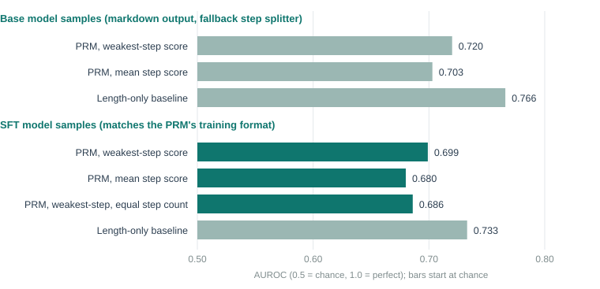

# Executive Summary

[Headline result:]{.lead} On 596 real solutions written by the SFT model, the process reward model separates right from wrong with **0.70 AUROC** (0.69 when compared only among chains with the same number of steps). A lazy rule that says "the shorter the answer, the likelier it is right" scores **0.73**. The PRM has a real signal beyond length, but it does not beat the length shortcut, and 0.70 is a weak verifier.

[In plain terms:]{.lead} Report 1 built a marker that grades each line of working, and it scored well on mistakes we planted ourselves. The real question is whether it can tell when the model's own working goes wrong. This report tests that by letting the model solve 150 fresh problems four times each, checking which final answers are right, and asking the marker to score every solution without seeing the answer.

[Findings:]{.lead}

- The first attempt used the base model, not the SFT model. It ignored the required tag format and wrote markdown with LaTeX on all 600 samples, so 0 of 600 could be read by the PRM as trained. The check was repeated on the SFT model, whose output matches the format.
- With a fallback splitter on the base model's markdown, the PRM scored 0.72 against 0.77 for the length-only rule. That test is unfair to the PRM (heavy format shift) and is reported for completeness only.
- On SFT samples, 596 of 600 solutions could be scored: 454 right, 142 wrong. The PRM's weakest-step score gives AUROC 0.699, its mean-step score 0.680, the length-only rule 0.733.
- Holding step count fixed (comparing only chains with the same number of steps) gives 0.686 over 8,907 right-vs-wrong pairs. The signal is not just "more steps means worse".
- Average score of right chains is 0.84; of wrong chains 0.60.
- NOTE: The PRM cannot yet be trusted as a replacement for checking the final answer. That finding motivated the real-negative training in report 3.

## Quick Stats

| Metric | Value |
|---|---|
| Test questions | 150 (GSM8K test rows 100 to 249) |
| Samples per question | 4 (temperature 0.8, top-p 0.95, up to 512 new tokens) |
| Policy, first attempt | Qwen2.5-3B-Instruct (base) |
| Policy, valid test | Qwen2.5-3B-Instruct after SFT on 742 traces |
| SFT chains scored | 596 of 600 (454 right, 142 wrong) |
| PRM AUROC, weakest step | 0.699 |
| PRM AUROC, weakest step, equal step count | 0.686 |
| Length-only baseline AUROC | 0.733 |

# Problem Statement

A reward model trained on planted mistakes could simply learn to check arithmetic. Real reasoning errors are broader: a wrong setup, a misread quantity, a skipped step. If the marker cannot flag those, using it as a reward would teach the model to write arithmetic that looks tidy, not reasoning that is right.

The test needs three things: real solutions the PRM has not seen, a label for each that does not depend on the PRM (whether the final answer is correct), and a fair yardstick. The yardstick used here is a deliberately lazy scorer that always prefers shorter answers. It costs nothing, and any useful scorer must beat it or it is only measuring length.

# Data

## Test questions

150 questions from the GSM8K **test** split (rows 100 to 249). The PRM's training questions come from the train split, and the model evaluations elsewhere use test rows 0 to 299 for accuracy only, so none of these are used for training.

## Samples

Each question was answered 4 times by the policy, giving 600 solutions per policy. A solution counts as **right** if its final number matches the reference. Right/wrong labels are by final answer only, which is noisy: a solution can reach the right number through flawed steps, or reach a wrong number after mostly good steps.

## Two policies

| Policy | Output style | Solutions the PRM could read |
|---|---|---|
| Base Qwen2.5-3B-Instruct | Long markdown, bold headers, LaTeX | 0 of 600 in the trained tag format |
| SFT model | `<reasoning>` then `<answer>` tags, terse | 596 of 600 |

The base model averaged 296.1 output tokens per solution; the SFT model 111.7.

# Method

The check is implemented in `validate_prm.py`:

1. Sample solutions from the policy on the test questions.
2. Extract the reasoning, split it into steps with the same splitter used for training, and score every step with the PRM.
3. Turn step scores into a chain score: the minimum, and separately the mean.
4. Compute AUROC of the chain score for predicting "final answer right".
5. Compute the same AUROC for the length-only rule, using negative output tokens as the score.
6. Compute a **step-count-controlled AUROC**: compare right and wrong chains only within groups that have the same number of steps, then average the groups weighted by the number of pairs.

Chains with no parseable steps are left out of the AUROC (4 of 600 for the SFT model).

# Results

## Base model samples (not a fair test)

The base model does not follow the tag format, so 0 of 600 could be parsed as trained. As a fallback, markdown and LaTeX marks were stripped, and non-empty lines containing a digit were treated as steps. 600 solutions could then be scored: 476 right and 124 wrong.

| Score | AUROC |
|---|---|
| PRM, weakest step | 0.720 |
| PRM, mean step | 0.703 |
| Length-only rule | 0.766 |

These values come from re-scoring the saved samples on CPU in 32-bit precision so that anyone can regenerate them (`tools/extract_per_chain.py --base`). The original run on a GPU in bf16 gave 0.719 and 0.704.

Average weakest-step score: 0.80 for right chains, 0.50 for wrong ones. Bullet lists, LaTeX and section headers are nothing like the training data, so this is a stress test, not a verdict.

## SFT model samples

| Measure | Value |
|---|---|
| Solutions scored | 596 |
| Accuracy on scored solutions | 0.762 (454 right, 142 wrong) |
| PRM AUROC, weakest step | 0.699 |
| PRM AUROC, mean step | 0.680 |
| PRM AUROC, weakest step, equal step count | 0.686 (8,907 pairs) |
| Length-only AUROC | 0.733 |
| Average weakest-step score, right chains | 0.839 |
| Average weakest-step score, wrong chains | 0.603 |



## Interpretation

- **The signal is real.** 0.686 among chains with equal step count is well above 0.5, so the PRM is not just counting steps.
- **It is not enough.** A rule with no knowledge of maths, only the answer length, does better (0.733). At 0.70, the PRM would often rank a wrong solution above a right one.
- **Weakest step beats mean step** (0.699 vs 0.680), which supports the "weakest link" scoring rule.
- **Consequence.** Replacing the exact-match reward with this PRM alone would swap a perfectly reliable signal for a noisy one. The safer first experiment keeps exact-match as an anchor and adds the PRM on top (`--reward prm+outcome`).

# Limitations

- **Few independent questions.** 596 chains come from 150 questions, so they are not independent, and uncertainty ranges from resampling chains would be too narrow. Report 3 resamples questions.
- **Noisy labels.** Final-answer correctness is not step-level correctness.
- **Format shift.** The base-model result mixes "bad PRM" with "unfamiliar formatting".
- **One SFT model.** These chains come from the first SFT training run. Later SFT runs are different models.
- **No confidence interval on the headline here.** The gap between 0.699 and 0.733 was not tested for significance in this report.

# Code Structure & Reproducibility

Branch `reasoning/prm`, pushed in commit 7357d50. The script `validate_prm.py` samples on a GPU and then scores with the PRM; a later addition (`--reuse`, commit 4f73906) lets it rescore previously saved samples, which is how the same 596 chains were used to compare later PRMs.

```
python -m training.reasoning.validate_prm \
    --policy <merged SFT model dir> --no-system \
    --count 150 --samples 4 --output data/prm_validation_sft.json
```

Saved locally (untracked): `data/prm_validation.json` (base model) and `data/prm_validation_sft.json` (SFT model), each with all 600 solutions, labels and scores.

The data behind the chart, and per-chain scores for every chain, are in `docs/prm-reports/data/` (`fig_validation.csv`, `per_chain_sft.csv`, `per_chain_base_fallback.csv`). `tools/analysis.py` recomputes every AUROC in this report from the per-chain files.

# Appendix

## Discontinued Ideas

**Using the base model as the test policy.** The first design sampled from the base model with a system prompt asking for the tag format. It ignored the prompt entirely. The fallback rescoring gives a rough figure, but a fair test requires a policy whose output matches the PRM's format, which is why the SFT model became the test policy.

**Reporting length-controlled results only.** Length-controlled AUROC is useful but hides the practical fact that a trivial rule outperforms the PRM on raw AUROC. Both numbers are reported.

## Glossary

<!--GLOSSARY: AUROC; Length-only baseline; PRM (process reward model); Baseline; SFT; Step; Token; n; Trace-->
