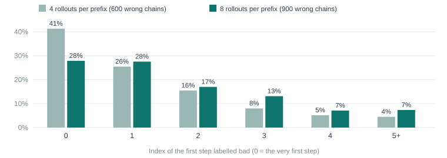
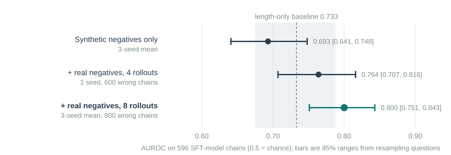

# Executive Summary

[Headline result:]{.lead} Adding the model's own real mistakes to the training data lifts the process reward model from **0.693 to 0.800 AUROC** (three-seed means on the same 596 test chains). The gain over synthetic-only training is **+0.073 to +0.153** (95% range), and the three seeds agree (0.807, 0.783, 0.809). The PRM now sits above the length-only rule (0.733), but the margin is thin: the 95% range for the difference is **+0.003 to +0.132**.

[In plain terms:]{.lead} Report 2 showed the marker trained on planted mistakes was weak on the model's real mistakes. This report builds training data from those real mistakes. The model solves fresh problems; wrong solutions are found; and to locate the line where each went wrong, the model is asked to finish the solution from each line several times. If none of the finishes ever reaches the right answer, that line is probably where it broke. Then the marker is retrained and tested again on the same solutions as before.

[Findings:]{.lead}

- More rollouts made labels steadier. With 4 finishes per line, 41% of wrong chains were blamed on their very first step; with 8, 28%. The 41% was probably inflated by hard problems, where every finish fails whatever the early steps look like.
- With real negatives, the three-seed mean AUROC is **0.800** [0.751, 0.843]; without, **0.693** [0.641, 0.748].
- Holding step count fixed, AUROC is 0.795, 0.761 and 0.804 for the three seeds with real negatives, against 0.684, 0.682 and 0.713 without.
- Against the length-only baseline the improvement is borderline: the difference range only just excludes zero.
- A first attempt that trained all layers at the same learning rate on a GPU failed: even the synthetic-only control fell from 0.954 to 0.613 on its own held-out set. Only after reverting to training the top 8 layers did the comparison become valid.
- NOTE: The labels are noisy and biased by question difficulty. They are better than no real negatives, not correct.
- NOTE: The chains used to train were sampled from a retrained SFT model, and the chains used to test come from the first SFT run.

## Quick Stats

| Metric | Value |
|---|---|
| Fresh training questions | 1,400 (GSM8K train, none among the 742 trace questions) |
| Samples per question | 4 from the SFT model |
| Correct chains kept | 2,545 (up to 2 per question) |
| Wrong chains found | 1,134, of which 900 were step-labelled |
| Rollouts | 30,296 (3,787 prefixes x 8) |
| Total real chains for training | 3,445 (plus the synthetic set from report 1) |
| PRM AUROC, synthetic only (3 seeds) | 0.693 |
| PRM AUROC, with real negatives (3 seeds) | 0.800 |
| Length-only baseline | 0.733 |

# Problem Statement

Report 2 measured the PRM at 0.70 AUROC on real SFT-model solutions, below the length-only rule. Two explanations fit: the planted mistakes are too different from real ones, or a 0.5B model on a few hundred terse traces simply cannot do better. The first can be tested cheaply by training on real mistakes.

The obstacle is labelling. For a wrong solution we know only that the final answer is wrong, not which line broke. Human labels are unavailable, so step labels have to be inferred.

# Data

## Sampling real solutions

The SFT model answered fresh GSM8K **train** questions, excluding any question among the 742 trace questions. Sampling used temperature 0.8, top-p 0.95, up to 384 new tokens, 4 answers per question.

| | Version 1 | Version 2 |
|---|---|---|
| Questions | 800 | 1,400 |
| Correct chains kept (at most 2 per question) | 1,416 | 2,545 |
| Wrong chains found | 728 | 1,134 |
| Wrong chains step-labelled | 600 | 900 |
| Rollouts per line | 4 | 8 |
| Rollouts generated | 10,236 | 30,296 |
| Lines (prefixes) rolled out | 2,559 | 3,787 |
| Chains in the training file | 2,016 | 3,445 |

## Labelling by rollout (the Monte-Carlo idea)

For a wrong chain with *n* steps, every prefix of 1 to *n*-1 steps is continued by the model 4 or 8 times (temperature 0.8, up to 256 new tokens). A prefix is judged "recoverable" if at least one continuation reaches the right final answer.

- The **first bad step** is the first prefix from which no continuation recovers; the step just added is labelled 0.
- If every prefix is recoverable, the last step is labelled 0 (the chain is known to be wrong somewhere).
- Steps before the first bad step are labelled 1; steps after it are masked, as in report 1.
- Correct chains get 1 on every step.

This is a "hard" estimate (any success counts). It is cheap and simple, and it inherits a known weakness: whether continuations succeed depends on how hard the problem is as well as on whether the line was correct.



| First bad step | 4 rollouts (600 chains) | 8 rollouts (900 chains) |
|---|---|---|
| Step 0 | 248 (41.3%) | 251 (27.9%) |
| Step 1 | 153 (25.5%) | 248 (27.6%) |
| Step 2 | 93 (15.5%) | 153 (17.0%) |
| Step 3 | 48 (8.0%) | 118 (13.1%) |
| Step 4 | 31 (5.2%) | 64 (7.1%) |
| Step 5 or later | 27 (4.5%) | 66 (7.3%) |

# Method

Two PRMs are trained with identical settings from report 1 (top 8 layers, 2 epochs, 32-bit precision), differing only in data:

| Arm | Training data |
|---|---|
| Real | Synthetic set from report 1 (631 questions) plus the real chains |
| Synthetic only (control) | Synthetic set alone |

Each arm is trained with seeds 0, 1 and 2. A seed changes the random order of training and, in this script, the split of questions into training and held-out for its internal check. All six models are then scored on the **same 596 SFT chains** from report 2, so the comparison is like for like.

Uncertainty is measured by resampling **questions** (400 times), not chains, because four chains share each question. For each resample the three seeds' AUROCs are averaged.

# Results

| Seed | Synthetic only | With real negatives (8 rollouts) |
|---|---|---|
| 0 | 0.686 | 0.807 |
| 1 | 0.706 | 0.783 |
| 2 | 0.686 | 0.809 |
| **Mean** | **0.693** | **0.800** |
| Mean, equal step count | 0.693 | 0.787 |



| Comparison | 95% range for the difference |
|---|---|
| With real negatives minus synthetic only | +0.073 to +0.153 |
| With real negatives minus length-only rule | +0.003 to +0.132 |

Version 1 (4 rollouts, one seed) gave 0.764 [0.707, 0.816] against 0.689 for its synthetic-only control, a difference of +0.006 to +0.144.

## Reading

- **Real negatives help.** The improvement is consistent across seeds and its range excludes zero comfortably.
- **The margin over length is thin.** The PRM is now better than the lazy rule, but only just clearly. This is why the quality bar was judged "borderline pass" and not "pass".
- **0.80 is still far from ground truth.** Used as the only reward, the PRM would misrank many pairs.
- **A trade-off exists.** On the version 1 internal held-out set of planted mistakes, the real-trained PRM scored 0.931 against 0.957 for synthetic-only. Real training bought a better fit to real mistakes at a small cost on planted ones. Version 2's internal metrics were logged on the GPU machine and not retrieved before it was deleted.

# Limitations

- **Label bias.** Hard problems produce "no continuation recovers" early, so their wrong chains skew toward early first-bad-step labels. Eight rollouts reduce this; they do not remove it.
- **Two different SFT models.** Training chains came from a retrained SFT model; the 596 test chains came from the first SFT run. If the two models make different kinds of mistakes, the test slightly understates or overstates real-world fit.
- **Small test.** 150 questions. Ranges are wide relative to the gaps between the length rule and the PRM.
- **No downstream test.** AUROC is a proxy. Whether a reward with 0.80 AUROC helps or harms GRPO has not been tested.

# Code Structure & Reproducibility

Branch `reasoning/prm`, commit 4f73906.

```
gen_real_negatives.py   sample, label by rollout, write chains (one JSON per line)
train_prm.py --extra    add prebuilt real chains to the training set only
validate_prm.py --reuse rescore a saved sample file with a new PRM
```

Version 2 data generation and PRM training:

```
python -m training.reasoning.gen_real_negatives \
   --policy <merged SFT dir> --questions 1400 --max-wrong 900 \
   --rollouts 8 --batch 96 --output data/prm_real_v2.jsonl
python -m training.reasoning.train_prm --extra data/prm_real_v2.jsonl \
   --train-layers 8 --epochs 2 --seed 0 --output outputs/prm_real_s0
python -m training.reasoning.validate_prm --reuse data/prm_validation_sft.json \
   --prm outputs/prm_real_s0 --output data/val_real_s0.json
```

Rollout generation ran at roughly 4 rollouts per second on one RTX 4090 with plain batched generation, so 30,296 rollouts dominated the run. Each PRM trained in a few minutes (six trainings plus six rescorings finished in well under half an hour). Training data (`prm_real.jsonl`, `prm_real_v2.jsonl`) and all scoring results are saved locally and are not tracked by git. Trained PRM weights from these runs were lost when the GPU machine was deleted; retraining from the saved data takes minutes.

# Appendix

## Full Results by Model

| Model | Seed | AUROC (weakest step) | AUROC, equal step count |
|---|---|---|---|
| Synthetic only | 0 | 0.686 | 0.684 |
| Synthetic only | 1 | 0.706 | 0.682 |
| Synthetic only | 2 | 0.686 | 0.713 |
| Real, 8 rollouts | 0 | 0.807 | 0.795 |
| Real, 8 rollouts | 1 | 0.783 | 0.761 |
| Real, 8 rollouts | 2 | 0.809 | 0.804 |
| Real, 4 rollouts | 0 | 0.764 | 0.750 |
| Synthetic only (version 1 control) | 0 | 0.689 | 0.684 |

## Discontinued Ideas

**Training all layers on a GPU.** The first GPU attempt trained every layer of the backbone in 32-bit precision at the learning rate used for the top layers. It failed on both arms: the synthetic-only control fell from 0.954 (report 1) to 0.613 on its own held-out set, and on the 596 real chains the two arms scored 0.637 (synthetic) and 0.569 (real). With the control broken, nothing could be concluded about real negatives. The cause was not investigated; a learning rate too high for full training is the likeliest, and switching back to the top-8-layer recipe gave sensible results immediately.

**Four rollouts per line.** Kept as version 1 and reported above. Labels were noisier (41% blamed on step 0) and the result, while positive, had a wider range.

## Glossary

<!--GLOSSARY: Monte-Carlo rollout; Corruption (synthetic negative); PRM (process reward model); AUROC; Bootstrap; Confidence interval (95% range); Seed; Length-only baseline; SFT; Step-->
