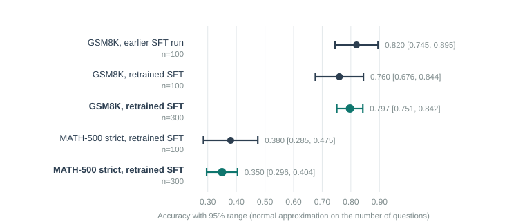

# Executive Summary

[Headline result:]{.lead} The SFT model (Qwen2.5-3B-Instruct fine-tuned on 742 teacher solutions) scores **0.797 on GSM8K** [0.751, 0.842] and **0.350 on MATH-500 in strict format** [0.296, 0.404], measured on 300 questions each, with average answer lengths of **104.9 and 259.8 tokens**. The earlier reference figure of 0.82 on GSM8K was not reproduced; the three readings of the same recipe (0.82, 0.76, 0.797) all fall inside the noise of their tests.

[In plain terms:]{.lead} Before testing whether a new reward makes the model shorter and no less accurate, we need a trustworthy starting score and a starting answer length. The earlier score came from 100 questions, which is like judging a coin from 100 flips. Here the model is retrained and tested on 300 questions, and the answer lengths are recorded for the first time.

[Findings:]{.lead}

- The retrained model scored 0.76 on 100 GSM8K questions and 0.797 on 300. The earlier 0.82 was also on 100. With a typical error of about 4 points at n=100, all three sit around 0.8.
- At n=300 the 95% range on GSM8K is about 9 points wide (0.751 to 0.842). A difference of a few points between two training methods cannot be resolved with 300 questions.
- MATH-500 fell from 0.38 (first 100 questions) to 0.35 (first 300), so the next 200 questions were harder or the earlier figure was lucky.
- Correct answers are shorter than average: on GSM8K 100.3 tokens vs 104.9 overall; on MATH-500 179.0 vs 259.8. Wrong MATH answers are much longer, possibly rambling or hitting the 512-token limit (not checked).
- To make 300-question evaluations affordable, `eval_judge.py` gained batched decoding (`--batch`). It has not been checked against one-at-a-time decoding on the same model.
- NOTE: Answer length is confounded with accuracy. If a later model gets shorter partly because it gives up on hard problems, that is not the same as tighter reasoning.

## Quick Stats

| Metric | Value |
|---|---|
| Model | Qwen2.5-3B-Instruct + LoRA, SFT on 742 unique traces |
| GSM8K accuracy, n=300 | 0.797 [0.751, 0.842] |
| MATH-500 strict accuracy, n=300 | 0.350 [0.296, 0.404] |
| Average output tokens, GSM8K | 104.9 (100.3 on correct answers) |
| Average output tokens, MATH-500 | 259.8 (179.0 on correct answers) |
| Earlier reference (n=100) | GSM8K 0.82, MATH-500 0.39 |
| SFT training time | about 5 to 6 minutes on one RTX 4090 |

# Problem Statement

The project's earlier results (Qwen2.5-3B-Instruct, 100 questions each) were:

| Model | GSM8K | MATH-500 strict |
|---|---|---|
| Base | 0.77 | 0.39 |
| SFT | 0.82 | 0.39 |
| GRPO with exact-match reward | 0.79 | 0.38 |

These were checked against the saved result files (`eval_base_r2.json`, `eval_sft_r2.json`, `eval_grpo_r2.json` and the matching `_math_` files, 100 questions each). The SFT and GRPO rows come from the run on the 742-trace set with shaped rewards; the project's campaign notes record that the earlier run on only 235 traces also scored 0.82 for SFT and 0.79 for GRPO, so tripling the data changed nothing. Those figures had no answer-length measurement, and the SFT checkpoint behind them is not available. The claim to test is "shorter chains at equal accuracy", which needs a baseline for both accuracy and length, measured on a test large enough for the accuracy figure to mean something.

# Data

## Training data

The 742 unique question-and-solution pairs described in report 1 (GSM8K train questions; solutions written by DeepSeek R1-0528 and V3.2 and checked against the reference answer): each solution is the teacher's reasoning wrapped in `<reasoning>` tags followed by the final number in `<answer>` tags. Solutions average 46 words. The model is shown the question as the user's turn and the tagged solution as its reply, with no system prompt.

## Test data

| Test | Questions used | Scoring |
|---|---|---|
| GSM8K (test split) | first 300 | Final number must match the reference |
| MATH-500 | first 300 | Strict: the answer must be inside `<answer>` tags and match exactly |

Decoding was greedy (no randomness), up to 512 new tokens.

# Method

## SFT recipe

| Setting | Value |
|---|---|
| Base | `Qwen/Qwen2.5-3B-Instruct` |
| Adapter | LoRA, rank 64, alpha 128, dropout 0.05, all linear layers |
| Learning rate / schedule | 1e-4, cosine |
| Epochs | 2 (48 optimiser steps) |
| Batch | 2 per step with 16 accumulation steps (effective 32) |
| Maximum length | 1,024 tokens |
| Loss | plain next-token loss (`nll`) |
| Precision | bf16 |

These are the settings the project had found necessary to fit a 24 GB card. In the first run training loss fell from about 0.29 to 0.22 and average token accuracy reached 0.944. Runs finished in about 295 to 365 seconds.

After training, the adapter is merged into the base weights and the merged model is evaluated.

## Evaluation

`eval_judge.py` writes, for each test, the accuracy, the average number of output tokens, and the average over correct answers only. Token counts come from the model's own output ids, excluding padding.

For the 300-question runs a `--batch` option decodes several questions at once (left padding; batch 32 for GSM8K and 16 for MATH-500). The original one-at-a-time path is still the default.

Ranges use a normal approximation: accuracy plus or minus `1.96 * sqrt(p*(1-p)/n)`.

# Results



| Run | GSM8K | Tokens (correct only) | MATH-500 strict | Tokens (correct only) |
|---|---|---|---|---|
| Earlier SFT (n=100) | 0.82 | not recorded | 0.39 | not recorded |
| Retrained SFT (n=100) | 0.76 | 104.9 (96.7) | 0.38 | 241.1 (171.9) |
| **Retrained SFT (n=300)** | **0.797** | **104.9 (100.3)** | **0.350** | **259.8 (179.0)** |

## What the numbers support

- **A stable starting point.** About 0.80 on GSM8K and about 0.35 on MATH-500, on the first 300 questions of each.
- **No evidence of a real drop from 0.82.** The two n=100 readings of similar recipes differ by six points, which is about one standard error of the difference between two such tests (roughly 6 points), so it is consistent with test noise plus differences between separate training runs.
- **What a later method must show.** For two models tested on the same 300 questions, a gap of only a few points is inside the noise. Answer length is the more sensitive measure because it is far less noisy than accuracy, but it must be read alongside accuracy (see the note on confounding in the summary). A comparison on the same questions can use a paired test, which is more sensitive than comparing two ranges.

# Limitations

- **Different training runs.** The n=100 and n=300 numbers come from separate SFT runs on separate machines. Random initialisation and data order differ between runs, so some of the difference is run-to-run variation, not evaluation size.
- **Batched decoding not verified.** Batching with padding can, in principle, change greedy outputs slightly compared with one at a time. The n=100 (one at a time) and n=300 (batched) results are on different models, so they cannot settle this.
- **The two token counts of 104.9 are a coincidence.** Both runs report the same average GSM8K length to one decimal place; nothing links them.
- **The first 300 questions only.** They may not represent the whole test set.
- **Truncation is unmeasured.** How many MATH-500 answers hit the 512-token limit was not counted.

# Code Structure & Reproducibility

Branch `reasoning/prm`. The length fields in `eval_judge.py` are in commit 79952a9 and the `--batch` option is in commit 31cf5cc; both are pushed.

```
python -m training.reasoning.train_sft --base Qwen/Qwen2.5-3B-Instruct \
   --data data/reasoning_sft.jsonl --batch 2 --grad-accum 16 --seq-length 1024
python -m training.reasoning.merge --base Qwen/Qwen2.5-3B-Instruct \
   --adapter outputs/reasoning-sft --output outputs/reasoning-sft-merged
python -m training.reasoning.eval_judge --model outputs/reasoning-sft-merged \
   --limit 300 --batch 32 --output data/eval300_sft_gsm8k.json
python -m training.reasoning.eval_judge --model outputs/reasoning-sft-merged \
   --dataset HuggingFaceH4/MATH-500 --limit 300 --strict --batch 16 \
   --output data/eval300_sft_math.json
```

Software pins: torch 2.6.0 (CUDA 12.4), transformers 5.17.0, trl 1.13.0, peft 0.20.0, datasets 5.0.1.

Saved locally (untracked): `data/eval_sft_tok.json` and `data/eval_sft_math_tok.json` (n=100), `data/eval300_sft_gsm8k.json` and `data/eval300_sft_math.json` (n=300), each with per-question rows.

# Appendix

## Discontinued Ideas

**Keeping the SFT adapter.** The trained adapter is 479 MB. Downloading it from the rental machine ran at roughly 50 KB per second, and two overlapping resume attempts risked corrupting the file. The partial file was deleted. The plan instead: whichever later experiment needs this model retrains it in the same session on the same machine and re-evaluates it there, so every arm shares one SFT model.

**A 7B model.** Earlier work found that 7B LoRA SFT never fit a 24 GB card across six configurations. It was not revisited here.

**Treating 0.82 as the number to beat.** With 100 questions, the reading is inside the noise of the retrained model. The 300-question figure is the comparison point going forward.

## Glossary

<!--GLOSSARY: SFT; LoRA / adapter; GSM8K; MATH-500; Token; n; Baseline; Confidence interval (95% range); GRPO; Fine-tuning-->
