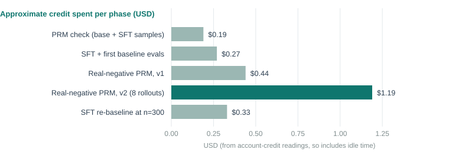

# Executive Summary

[Headline result:]{.lead} Four rented RTX 4090 machines ran every GPU job in this work. Total spend was about **$2.42** of the $25.95 credit on the account, leaving **$23.53**, and all four machines are deleted. The most expensive lesson was that a stopped machine cannot be relied on to restart: twice, the host had rented the GPU to someone else, so every result and every rebuildable input had to live on the laptop.

[In plain terms:]{.lead} The training and tests need graphics cards that a laptop does not have, so they were rented by the hour from a marketplace (Vast) and deleted after each job. This report records what was rented, what it cost, what went wrong, and how the repository was arranged so that several pieces of work could proceed without overwriting each other.

[Findings:]{.lead}

- The account started this work with $0.00 balance and $0.95 credit, not the roughly $7 in the project brief. That fits the earlier record: a $7.71 top-up during the previous campaign, then about $20.5 spent across two machines. The credit later read $25.95 when the first GPU job started.
- Cost per phase was between about $0.19 and $1.19. The largest was the second real-negative run (30,296 rollouts).
- Host drivers on the machines rented were 580 to 615, so the old CUDA workaround needed for driver 535 hosts was never required.
- The proxy address Vast gives for SSH closed connections on one machine; the machine's direct public address and port worked.
- Large downloads over the rental machines' uplink were slow and unreliable (one 479 MB file ran at about 50 KB per second and was abandoned).
- Work was done in a separate git worktree on its own branch so other branches were not moved.
- The instance list first appeared empty because it called a deprecated endpoint that returns an error, not a list. The current endpoint (`/api/v1/instances/`) was used for the final check and shows 0 instances; ten older instance IDs from earlier notes all return not found.
- NOTE: Costs are read from account-credit balances between phases, so they include idle time and are approximate.

## Quick Stats

| Metric | Value |
|---|---|
| Machines rented | 4 (all RTX 4090, one GPU) |
| Machines deleted | 4 of 4 |
| Price range | $0.367 to $0.481 per hour |
| Spend | about $2.42 |
| Credit remaining | $23.53 |
| Instances remaining | 0 (checked with the current list endpoint) |
| Restart attempts that failed | 2 (`resources_unavailable`) |
| Code commits pushed | 4 (79952a9, 7357d50, 4f73906, 31cf5cc) |

# Problem Statement

The brief set rules for the work: rent GPUs with the existing API key, shut every machine down when done, keep an eye on a small budget, and avoid a list of known time sinks (a pinned PyTorch version, stale accessory libraries, SSH and background-process traps, dropped hosts). It also noted that several earlier agents had shared one working copy of the repository and that branches had moved under each other.

# Data

## Machines

| ID | Location and price | Driver | Used for | End |
|---|---|---|---|---|
| 51468149 | Oregon, $0.469/h | 580.159 | Trying the PRM on base-model samples; SFT run 1; PRM check on SFT samples; first 100-question evals | Restarted once, later restart failed; deleted |
| 51482907 | Illinois, $0.367/h | 580.95 | SFT run 2; real-negative data version 1; first PRM arms including the failed full-training arms | Restart failed; deleted |
| 51496010 | Utah, $0.456/h | 595.71 | Version 2 pipeline: SFT, 30,296 rollouts, six PRMs and their scoring | Deleted |
| 51524225 | Pennsylvania, $0.481/h | 615.71 | SFT re-baseline at 300 questions | Deleted |

All four used the image `pytorch/pytorch:2.6.0-cuda12.4-cudnn9-devel` with a 60 GB disk.

## Cost by phase

| Phase | Credit before | Credit after | Approximate cost |
|---|---|---|---|
| PRM check on base and SFT samples | $25.95 | $25.76 | $0.19 |
| SFT run and first baseline evals | $25.76 | $25.49 | $0.27 |
| Real-negative PRM, version 1 | $25.49 | $25.05 | $0.44 |
| Real-negative PRM, version 2 | $25.05 | $23.86 | $1.19 |
| SFT re-baseline at n=300 | $23.86 | $23.53 | $0.33 |
| **Total** | **$25.95** | **$23.53** | **$2.42** |

## Reference points from earlier work

From the project's earlier records (the OpenCode session history and commit messages), useful for planning the next runs:

- The previous month-2 campaign cost about $20.5 across two machines (commit 1ad415f).
- A 512-step GRPO run on a 24 GB card took roughly 24 minutes at about one second per step (logged in the earlier session).
- Older hosts with driver 535 needed the CUDA compatibility libraries removed and PyTorch pinned to 2.6 with CUDA 12.4; hosts with drivers 580 or newer did not.
- An earlier note listed a leftover exited instance (50615306) as needing cleanup. It no longer exists.

# Architecture

## The job routine that worked

1. **Find an offer.** One RTX 4090, at least 60 GB of disk, at least 300 Mb/s down, reliability at or above 0.97, price at or below $0.60/h. The cheapest few with a driver of 570 or newer were compared; a US location was preferred.
2. **Rent it** with the pinned image, a 60 GB disk and direct SSH.
3. **Wait for `running`**, then read the machine's public address and mapped SSH port from the API and connect to that directly.
4. **Install the pinned software:** transformers 5.17.0, trl 1.13.0, peft 0.20.0, datasets 5.0.1, accelerate; remove `torchvision` and `torchaudio` (a stale copy breaks importing transformers). PyTorch 2.6.0 with CUDA 12.4 is already in the image.
5. **Copy only what the job needs:** the code (excluding outputs and data), and the specific data files.
6. **Launch one detached script** that runs every stage and writes a `done` or `fail` marker file.
7. **Poll** with short connections that tolerate dropped links.
8. **Pull results** (small JSON files), not model weights.
9. **Delete the instance**, then confirm by looking it up by ID.

## Repository setup

The checkout at `crowd-finetune` is shared. Work was done in a second worktree, `crowd-finetune-prm`, on a new branch `reasoning/prm` created from `reasoning/ida-loop` after checking the branch head with `git rev-parse`.

- The brief named ida-loop at commit 4cc3d55. The branch head is actually 1ad415f; 4cc3d55 is an ancestor. The newer head was used.
- The project's `CLAUDE.md` describes the crowd question-and-answer game, not the reasoning track; the reasoning track's state was taken from the campaign status file and the code.
- Data files under `training/reasoning/data/` are untracked, so a new checkout does not contain them; the worktree copy holds only files created during this work, and the training traces stay in the main checkout.

# Issues and Fixes

| Symptom | Cause | Fix |
|---|---|---|
| Starting a stopped machine returned `resources_unavailable` (twice) | The host rented the GPU to another customer while it was stopped | Treat stopped machines as disposable; keep everything valuable on the laptop; delete after the last job |
| SSH through Vast's proxy address closed connections immediately | Proxy path failing for one machine | Use the machine's public address and mapped port from the API |
| File transfers dropped roughly every 500 MB | Unreliable host link | Use `--append` with a retry loop and verify checksums; never run two appending transfers of the same file |
| Transfer option rejected | macOS `rsync` does not support `--append-verify` | Use `--append` |
| 479 MB model file downloaded at about 50 KB/s | Slow host uplink | Abandoned; retrain in the same session as needed |
| SSH command hung when starting a background job | The background process kept the session's streams open | Put the job in a script and start it with `setsid nohup ... > log 2>&1 < /dev/null &` |
| Long waits were cut off | The shell tool blocks long sleeps and moves calls over 10 minutes to the background | Poll in loops under 10 minutes and chain them |
| Shell variables holding several options failed | The default macOS shell does not split unquoted variables | Use arrays or functions |
| `timeout` missing | Not on macOS | Use SSH's connect-timeout and keep-alive options |
| The instance list returned nothing | The list call used a deprecated endpoint that returns an error object, which was read as an empty list | Use `/api/v1/instances/` for listing, and look up single instances by ID |
| Smoke-test output appeared in the main checkout | A path resolved beside the data files, not the code | The stray folder was removed and the path fixed |

# Results

- All GPU-dependent results in reports 2 to 4 were produced within the budget and all four machines are deleted.
- No trained model weights were kept. Every model can be rebuilt from saved data and the commands in each report in minutes.
- Saved locally and untracked: sampling and scoring results, evaluation files, and training data for the PRM (`prm_real.jsonl`, `prm_real_v2.jsonl`).

# Limitations

- **Costs are approximate.** They are derived from credit readings between phases, not billing lines.
- **Idle time is included.** Time spent waiting for a machine or polling is charged and counted.
- **Not tested here:** the earlier 535-driver workaround, other GPU types, and multi-machine runs.

# Code Structure & Reproducibility

Branch `reasoning/prm` on the remote repository; commits 79952a9 (PRM, GRPO reward hook, length tracking), 7357d50 (validation script), 4f73906 (real-negative data) and 31cf5cc (batched decoding in `eval_judge.py`).

The data behind the cost chart and the machines table is in `docs/prm-reports/data/` (`fig_cost.csv`, `table_machines.csv`).

The job scripts used on the machines were throwaway shell files (SFT and merge, sampling and labelling, PRM training and scoring, evaluation) and were not kept in the repository. Each report lists the underlying commands.

# Appendix

## Discontinued Ideas

**Keeping stopped machines for their disks.** The idea was to reuse the trained weights on a stopped machine. Twice the machine could not restart, and the weights would have needed a slow, failure-prone download. The rule now: keep only small result files, rebuild the rest.

**Pulling trained models to the laptop.** The 2 GB PRM and 479 MB adapter transfers were unreliable on the rental network. One PRM weight file did transfer, with several resumed attempts and checksums; nothing else was worth the time.

## Glossary

<!--GLOSSARY: Vast; SFT; LoRA / adapter; Token; GRPO-->
