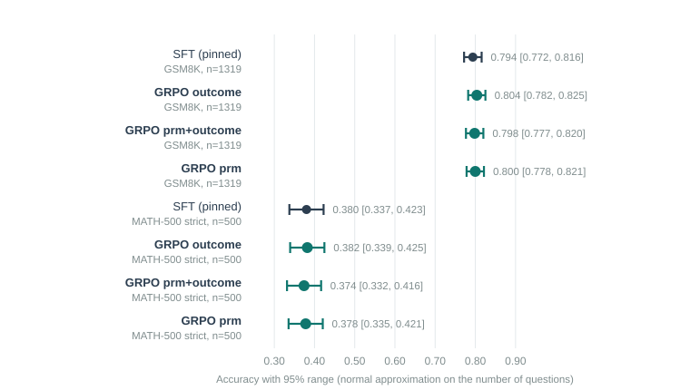
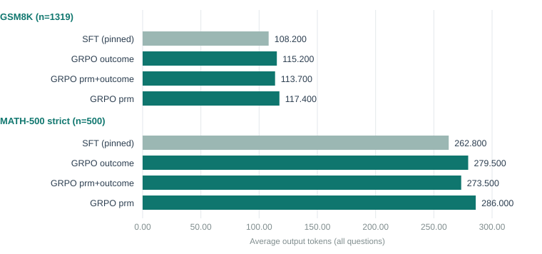
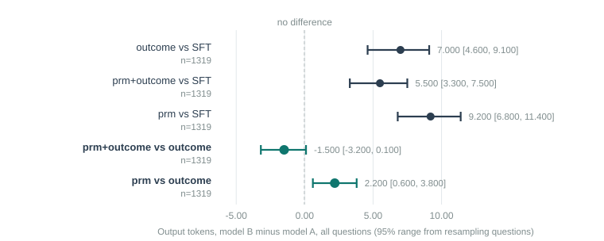

# Executive Summary

[Headline result:]{.lead} The claim under test — that a step-level reward gives **shorter chains at equal accuracy** — does not hold at this scale. Trained from one pinned SFT model, all three GRPO variants (exact-match only, PRM plus exact-match, PRM only) score **statistically indistinguishable** from the SFT baseline and from each other on both GSM8K (n=1,319) and MATH-500 (n=500). Every variant produces **significantly longer** answers than SFT, not shorter — the opposite of the hypothesis. The one exception is narrow: `prm+outcome` is significantly shorter than the exact-match-only control on MATH-500 (−6.0 tokens) and on GSM8K's both-correct subset (−1.4 tokens), at accuracy indistinguishable from that control. `prm` alone shows the reverse (longer, not shorter) on both benchmarks, so the effect does not generalise across reward designs.

[In plain terms:]{.lead} Reports 1 to 5 built and validated a marker that grades each line of a solution instead of only the final answer. This report is the actual test: train with that marker as (part of) the reward and see whether the model's answers get shorter without getting worse. They do not. If anything, training makes every model's answers longer, most plausibly because a length-shaping term already present in the reward pulls output toward roughly 400 characters, well above the terse baseline. Reported honestly, as a negative result.

[Findings:]{.lead}

- One session, one SFT model. That model produced the PRM's training data, the PRM validation set, and the GRPO starting point, removing the model-mismatch caveat carried by reports 2 and 3.
- Re-validating the PRM on this pinned model's own samples gives AUROC 0.797 (real negatives) versus 0.719 (synthetic only) versus 0.759 (length-only rule) — consistent with report 3's separately trained PRM (0.800 / 0.693 / 0.733), so that result was not a fluke of one training run.
- No accuracy difference survives testing: every GRPO-vs-SFT and arm-vs-arm gap has a 95% range crossing zero, and every McNemar test has p ≥ 0.26.
- Every GRPO arm lengthens answers relative to SFT, and every one of those length gains is statistically real: +5.5 to +9.2 tokens on GSM8K, +10.7 to +23.2 tokens on MATH-500 (95% ranges excluding zero).
- `prm+outcome` is shorter than `outcome`-only on MATH-500 (−6.0 tokens, 95% range −11.8 to −0.3) and on GSM8K's both-correct subset (−1.4 tokens, range −1.9 to −0.9), with accuracy statistically unchanged. `prm` alone is longer than `outcome`-only on both benchmarks instead (+2.2 to +6.5 tokens).
- No sign of reward gaming: step counts and PRM scores on the actual eval outputs are similar across arms, and fewer than 0.4% of parsed chains collapsed to a single step in any arm.
- NOTE: the length-shaping reward that ships with `train_grpo.py` (`length_reward`, target ≈ 400 characters) is active in every arm, including the two PRM arms. It is a strong candidate explanation for the across-the-board lengthening, and it confounds any clean read of what the PRM reward does to length on its own.

## Quick Stats

| Metric | Value |
|---|---|
| GRPO prompts | 400, fresh GSM8K train questions (excludes the 742 SFT-trace and 1,400 PRM-data questions) |
| Reward arms | `outcome` (control), `prm+outcome`, `prm` |
| GRPO training | 800 optimiser steps per arm, ≈ 34–37 minutes each on one RTX 4090 |
| Eval sets | full GSM8K test (n=1,319), full MATH-500 (n=500), greedy decoding |
| Best GSM8K accuracy | 0.804 (`outcome`), vs SFT 0.794 — not significant |
| Shortest MATH-500 PRM arm vs its control | `prm+outcome` −6.0 tokens vs `outcome` (significant), accuracy unchanged |
| Everything vs SFT, on length | all three arms significantly longer, not shorter |

# Problem Statement

Reports 1–3 built a step-level process reward model (PRM) and showed it beats a naive "shorter answer is right" heuristic, but only just, and only after training on the model's own real mistakes. Report 4 fixed the accuracy and length baseline the comparison needs. What remained untested through report 5 was the actual experiment: swap the PRM into GRPO in place of, or alongside, exact-match, and see whether training produces the DeepCogito-style result — shorter reasoning chains at no cost in accuracy.

Two design risks were flagged going in and are addressed directly here:

- **Model mismatch.** Reports 2 and 3 trained the PRM on one SFT model's samples and tested it on another's. This report retrains SFT once and uses that single model for everything downstream.
- **Reward gaming.** A reward built from the minimum step score can be gamed by writing fewer, vaguer steps. This report checks step counts and PRM scores on the actual GRPO outputs, not just on accuracy.

# Data

## The pinned model and its outputs

SFT was retrained once on the same 742 traces as report 4 (same recipe: LoRA rank 64, 2 epochs, batch 2 × grad-accum 16, `nll` loss). That merged model is the source of every downstream artifact in this report: the real-negative PRM training data, the PRM validation chains, and the GRPO starting checkpoint.

## GRPO prompt pool

`make_grpo_pool.py` builds the prompt set: it excludes the 742 SFT-trace questions, then skips the first 1,400 remaining GSM8K train questions (the pool `gen_real_negatives.py` draws its 1,400 PRM-data questions from, in the same dataset order) before taking the next 400 as the GRPO pool. This guarantees no overlap between what the PRM was trained on and what GRPO trains against.

## Re-validating the PRM on the pinned model

Before touching GRPO, the same validation as report 2 (150 GSM8K test questions, 4 samples each) was re-run against this pinned SFT model, scored by a PRM trained on this model's own real mistakes (8 rollouts per prefix, matching report 3's better recipe).

| PRM variant | n scored | AUROC (weakest step) | AUROC (equal step count) | Length-only rule |
|---|---|---|---|---|
| Real negatives | 597 of 600 | **0.797** | 0.778 | 0.759 |
| Synthetic only | 597 of 600 | 0.719 | 0.689 | 0.759 |

This lands close to report 3's separately trained PRM (0.800 / 0.693 / 0.733 there), so the earlier result generalises across at least two independent SFT-model / PRM-training runs rather than being specific to one lucky seed.

# Method

## GRPO recipe

All three arms share every setting except the reward:

| Setting | Value |
|---|---|
| Base | the pinned SFT-merged model |
| Prompts | 400 (the pool above) |
| Generations per prompt | 8 |
| Batch / max completion | 4 / 1,024 tokens |
| Learning rate / KL weight | 1e-6 / 0.04 (`train_grpo.py` defaults) |
| LoRA | rank 32, alpha 64, all linear layers |
| Optimiser steps | 800 |

| Arm | Reward terms |
|---|---|
| `outcome` | exact-match + format + length |
| `prm+outcome` | PRM (weakest step) + exact-match + format + length |
| `prm` | PRM (weakest step) + format + length |

`format_reward` and `length_reward` are unchanged from the original pipeline and run in every arm: format gives +1.0 for a valid reasoning-and-answer block, −0.5 for an answer with no reasoning, −2.0 for neither; length gives up to +1.0 for completions near 400 characters, tapering off over the next 600.

## Evaluation and statistics

Each of the four models (SFT plus the three GRPO arms) was evaluated on the full GSM8K test split (1,319 questions) and the full MATH-500 (500 questions), greedy decoding, with completions saved. Comparisons between two models on the same question set are **paired**: a McNemar exact test on the discordant pairs for accuracy, and a case-resampling bootstrap (2,000 resamples of the shared question set) for both the accuracy difference and the output-token difference. "Both-right" token differences are computed only over questions both models answered correctly, to separate a real change in how correct answers are written from a change in which questions get answered at all.

## Reward-gaming check

For each model's saved GSM8K completions, steps were split with the same splitter used everywhere else in this project and scored with the real-negative PRM, then compared against the number of steps and the share of chains collapsed to one step or fewer.

# Results

## Accuracy: no arm beats noise



Every accuracy comparison in this report — three arms against SFT, and PRM arms against the outcome-only control — has a 95% range crossing zero and a McNemar p above 0.26 (see the appendix table for all ten comparisons). Nothing here should be read as one training recipe beating another on correctness.

## Length: everything got longer



| Comparison (GSM8K, n=1,319) | Token diff | 95% range |
|---|---|---|
| `outcome` vs SFT | +7.0 | [+4.6, +9.1] |
| `prm+outcome` vs SFT | +5.5 | [+3.3, +7.5] |
| `prm` vs SFT | +9.2 | [+6.8, +11.4] |

All three ranges exclude zero. The same holds on MATH-500, with larger gaps (+10.7 to +23.2 tokens). This is the opposite of the "shorter chains" hypothesis, for every reward design tested, including the two that use the PRM.

## The one PRM-specific signal



Comparing the two PRM arms against the `outcome`-only control, rather than against SFT, isolates what adding the PRM reward does on top of exact-match:

| Comparison | Benchmark | Token diff (all Qs) | 95% range | Token diff (both right) | 95% range | Accuracy diff | 95% range |
|---|---|---|---|---|---|---|---|
| `prm+outcome` vs `outcome` | GSM8K | −1.5 | [−3.2, +0.1] | −1.4 | [−1.9, −0.9] | −0.005 | [−0.017, +0.007] |
| `prm+outcome` vs `outcome` | MATH-500 | −6.0 | [−11.8, −0.3] | −7.4 | [−11.8, −3.1] | −0.008 | [−0.028, +0.012] |
| `prm` vs `outcome` | GSM8K | +2.2 | [+0.6, +3.8] | +1.1 | [+0.4, +1.8] | −0.004 | [−0.017, +0.008] |
| `prm` vs `outcome` | MATH-500 | +6.5 | [+1.3, +11.5] | +4.5 | [+0.2, +9.3] | −0.004 | [−0.022, +0.016] |

`prm+outcome` is the only arm that comes out shorter than its control, and on MATH-500 and on GSM8K's both-right subset that shortening is statistically real (both ranges exclude zero), at accuracy indistinguishable from the control. But the effect is small in absolute terms (1–2% of the baseline length) and it does not appear on GSM8K's unconditional comparison, and it reverses sign entirely for the `prm`-only arm, which is longer than the control on both benchmarks and both range types. A single arm showing a small, benchmark-dependent effect is not evidence of a general "PRM shortens chains" result.

## No sign of reward gaming

| Model | Parsed | Mean steps | Share ≤1 step | Mean PRM score (correct) | Mean PRM score (wrong) |
|---|---|---|---|---|---|
| SFT (pinned) | 1,311 / 1,319 | 4.33 | 0.4% | 0.878 | 0.719 |
| GRPO outcome | 1,311 / 1,319 | 4.51 | 0.2% | 0.884 | 0.715 |
| GRPO prm+outcome | 1,309 / 1,319 | 4.44 | 0.2% | 0.881 | 0.709 |
| GRPO prm | 1,306 / 1,319 | 4.50 | 0.2% | 0.887 | 0.730 |

Step counts, parse rates and PRM scores are all close across arms. None of the arms learned to write degenerate one-step "solutions" to inflate the reward, and the PRM-only arm's chains score no worse under its own PRM than the outcome-only arm's chains do.

# Limitations

- **The length reward is a confound.** `format_reward` and `length_reward` run in every arm, and `length_reward`'s target (≈400 characters) sits well above the SFT baseline's typical output. The uniform lengthening across all three arms, PRM included, is more consistent with that shared term dominating than with anything specific to the PRM. A cleaner test of "does the PRM reward alone change length" would drop or retarget `length_reward` for at least one additional arm.
- **One seed per arm.** Each of the three GRPO arms was trained once. The `prm+outcome` vs `outcome` MATH-500 effect, while its 95% range excludes zero, rests on a single training run per arm; a repeat with a different seed would show whether it survives.
- **KL to the SFT policy, not to a reference free of length pressure.** GRPO's KL term regularises toward the SFT starting point, which does not remove the length reward's pull; it only bounds how far training can drift.
- **Short training run.** 800 optimiser steps on 400 prompts is far short of the scale process-reward papers typically use. A null result here does not rule out an effect at larger scale or more training.
- **Greedy eval only.** Sampled (non-greedy) evaluation, closer to how GRPO itself explores during training, was not run and could show a different picture, particularly on length.

# Code Structure & Reproducibility

Branch `reasoning/prm`. Session tooling: `training/reasoning/run_prm_session.sh` (the full pipeline as one detached script), `make_grpo_pool.py`, `paired_compare.py` (McNemar + bootstrap), `score_eval_chains.py` (the gaming check), and `--prompts-file` / `--seed` / `--cpu` on `train_grpo.py`. All were smoke-tested on CPU with a 0.5B model in every reward mode before the paid run.

```
python -m training.reasoning.make_grpo_pool --count 400
python -m training.reasoning.train_grpo --base outputs/sft-merged --prompts-file data/grpo_pool.jsonl \
    --limit 400 --gens 8 --batch 4 --max-completion 1024 --reward prm+outcome --prm outputs/prm_real \
    --output outputs/grpo_prm_outcome
python -m training.reasoning.eval_judge --model outputs/grpo_prm_outcome_merged --limit 1319 --batch 96 \
    --save-text --output data/full_grpo_prm_outcome_merged_gsm8k.json
python -m training.reasoning.paired_compare data/full_sft-merged_gsm8k.json \
    data/full_grpo_prm_outcome_merged_gsm8k.json --label-a SFT --label-b "GRPO prm+outcome"
python -m training.reasoning.score_eval_chains data/full_grpo_prm_outcome_merged_gsm8k.json \
    --prm outputs/prm_real --out data/diag_grpo_prm_outcome_merged_gsm8k.json
```

Trained weights (SFT adapter, both PRMs, all three GRPO adapters) are uploaded as private Hugging Face model repos: `sushanth9/prm-track-sft-adapter`, `sushanth9/prm-track-prm`, `sushanth9/prm-track-grpo-outcome`, `sushanth9/prm-track-grpo-prm-outcome`, `sushanth9/prm-track-grpo-prm`. `training/reasoning/hf_upload.py` reproduces the upload given `HF_TOKEN`. The data behind every table and figure in this report is in `docs/prm-reports/data/` (`grpo_eval_results.csv`, `grpo_paired_comparisons.csv`, `grpo_gaming_diagnostics.csv`, `prm_validation_pinned_sft.csv`).

This session ran on one rented RTX 4090 (Vietnam and Korea hosts; the first four rental attempts before it failed with `resources_unavailable` or refused SSH and were deleted unused), cost about $2.71 against an approved $6 cap, and the instance was deleted afterward. Full detail on host churn belongs to report 5's format but happened after that report was written; the account credit fell from $23.26 to $20.55 across this session including the churn and the Hugging Face upload.

# Appendix

## Full Paired-Comparison Table

| Dataset | A | B | n | acc A | acc B | acc diff | 95% range | McNemar p | tok A | tok B | tok diff | 95% range |
|---|---|---|---|---|---|---|---|---|---|---|---|---|
| GSM8K | SFT | outcome | 1319 | 0.794 | 0.804 | +0.010 | [−0.006, +0.025] | 0.259 | 108.2 | 115.2 | +7.0 | [+4.6, +9.1] |
| GSM8K | SFT | prm+outcome | 1319 | 0.794 | 0.798 | +0.004 | [−0.011, +0.019] | 0.617 | 108.2 | 113.7 | +5.5 | [+3.3, +7.5] |
| GSM8K | SFT | prm | 1319 | 0.794 | 0.800 | +0.006 | [−0.011, +0.023] | 0.549 | 108.2 | 117.4 | +9.2 | [+6.8, +11.4] |
| GSM8K | outcome | prm+outcome | 1319 | 0.804 | 0.798 | −0.005 | [−0.017, +0.007] | 0.457 | 115.2 | 113.7 | −1.5 | [−3.2, +0.1] |
| GSM8K | outcome | prm | 1319 | 0.804 | 0.800 | −0.004 | [−0.017, +0.008] | 0.630 | 115.2 | 117.4 | +2.2 | [+0.6, +3.8] |
| MATH-500 | SFT | outcome | 500 | 0.380 | 0.382 | +0.002 | [−0.022, +0.028] | 1.000 | 262.8 | 279.5 | +16.7 | [+9.5, +24.2] |
| MATH-500 | SFT | prm+outcome | 500 | 0.380 | 0.374 | −0.006 | [−0.030, +0.018] | 0.743 | 262.8 | 273.5 | +10.7 | [+3.3, +17.7] |
| MATH-500 | SFT | prm | 500 | 0.380 | 0.378 | −0.002 | [−0.024, +0.022] | 1.000 | 262.8 | 286.0 | +23.2 | [+16.1, +30.0] |
| MATH-500 | outcome | prm+outcome | 500 | 0.382 | 0.374 | −0.008 | [−0.028, +0.012] | 0.557 | 279.5 | 273.5 | −6.0 | [−11.8, −0.3] |
| MATH-500 | outcome | prm | 500 | 0.382 | 0.378 | −0.004 | [−0.022, +0.016] | 0.845 | 279.5 | 286.0 | +6.5 | [+1.3, +11.5] |

## Discontinued Ideas

**A fourth arm without the length reward.** Not run in this session — it would have doubled the GRPO cost, and the budget was fixed in advance. Done as a follow-up (report 7): dropping `length_reward` brings both the outcome-only and PRM arms back to within noise of the SFT baseline's length, confirming `length_reward` as the dominant cause of the lengthening reported here, and confirming that the PRM reward has no shortening effect once that confound is removed.

**Sampled (temperature > 0) evaluation.** Greedy decoding was used throughout for comparability with reports 1–4. GRPO training itself explores with 8 sampled generations per prompt; whether the length effect looks different under sampled eval was not checked.

## Glossary

<!--GLOSSARY: GRPO; PRM (process reward model); Reward; Exact-match reward; Outcome vs process reward; Token; Confidence interval (95% range); Bootstrap; Seed; Control arm-->
