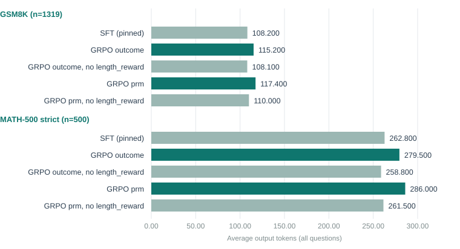
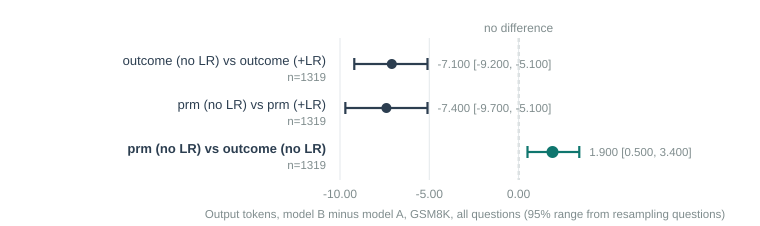
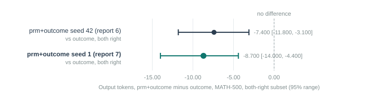

# Executive Summary

[Headline result:]{.lead} Report 6 found that every GRPO arm produced longer answers than SFT and flagged the pipeline's pre-existing `length_reward` term (target ≈400 characters) as the likely cause rather than the PRM. It was. Dropping `length_reward` returns both the outcome-only and PRM arms to within noise of the SFT baseline's length on GSM8K (**−0.1 tokens**, 95% range crossing zero) and close to it on MATH-500. With that confound removed, the PRM reward shows **no shortening effect** — if anything, the PRM arm is very slightly **longer** than the exact-match-only arm on both benchmarks, significantly so on GSM8K (+1.9 tokens). The one effect that did survive report 6 — `prm+outcome` writing shorter *correct* answers than the outcome-only control on MATH-500 — **replicates with a second random seed** (−7.4 and −8.7 tokens on the two seeds respectively, both 95% ranges excluding zero), so it looks like a real, small, reproducible effect specific to that reward combination and that benchmark, not noise from one lucky run.

[In plain terms:]{.lead} Report 6 could not tell whether "every model got longer" was because of the process reward or because of something else already baked into training. This report answers that by rerunning two of report 6's arms with the something-else switched off. It comes back off. The process reward, on its own, does not make answers shorter — the length-shaping term already in the pipeline was doing essentially all of the lengthening. One narrow, specific effect from report 6 held up under a repeat with a different random seed, and it is reported here as the one place the PRM reward may be doing something real, small as it is.

[Findings:]{.lead}

- Removing `length_reward` cuts GSM8K token counts by 7.1 (`outcome`) and 7.4 (`prm`) — both 95% ranges exclude zero — and MATH-500 by 20.7 and 24.5 tokens respectively. These reductions bring every arm back to statistically indistinguishable from SFT's own length on GSM8K, and close to it on MATH-500.
- With `length_reward` removed from both, `prm` (no length reward) is **longer**, not shorter, than `outcome` (no length reward): +1.9 tokens on GSM8K (significant), +2.7 on MATH-500 (not significant, wide range). On MATH-500's both-correct subset the gap is +7.2 tokens and significant. This is the cleanest possible PRM-vs-exact-match comparison in the whole project — no length-shaping term active on either side — and it points the wrong way for the hypothesis.
- Dropping `length_reward` costs a little accuracy for the PRM arm specifically: `prm` (no length reward) scores 1.7 points lower than `prm` (with length reward) on GSM8K, with a 95% range of [−3.5, 0.0] — right at the edge of excluding zero (McNemar p = 0.071). Suggestive, not conclusive.
- The seed-replication check: `prm+outcome` trained with a second, different seed still writes shorter correct MATH-500 answers than the outcome-only control (−8.7 tokens, range [−14.0, −4.4]), closely matching report 6's original run (−7.4 tokens, range [−11.8, −3.1]). The two `prm+outcome` seeds do not differ meaningfully from each other on accuracy or length on either benchmark.
- No new sign of reward gaming in the three new arms: step counts, parse rates and PRM scores on the actual outputs are all in the same range as report 6's arms.
- NOTE: an oversight in this session — the three new GRPO adapters were not uploaded to Hugging Face before the rental machine was deleted (unlike report 6's arms, all of which are on the Hub). All eval outputs, diagnostics and the raw completions behind every number in this report are saved and backed up; only the trained weights themselves would need a rerun to recover, since GRPO's own generation step is not bit-for-bit deterministic even with a fixed seed.

## Quick Stats

| Metric | Value |
|---|---|
| New arms | `outcome` and `prm`, each without `length_reward`; `prm+outcome` with a second seed |
| Reused from report 6 (not retrained) | the pinned SFT adapter and the real-negative PRM, both pulled from Hugging Face |
| GSM8K length, `outcome` (no length_reward) vs SFT | −0.1 tokens [−1.4, +1.0] — not significant |
| GSM8K length, `outcome` (+length_reward) vs (no length_reward) | −7.1 tokens [−9.2, −5.1] — significant |
| Cleanest PRM test, no length_reward on either side (GSM8K) | `prm` +1.9 tokens longer than `outcome` [+0.5, +3.4] — significant, wrong direction |
| Seed replication, `prm+outcome` vs `outcome`, MATH-500 both-right | seed 42: −7.4 [−11.8, −3.1]; seed 1: −8.7 [−14.0, −4.4] — both significant, same direction |
| Session cost | about $1.17 (well under the ~$2–3 estimate, since retraining SFT and the PRM was skipped) |

# Problem Statement

Report 6's biggest limitation was structural, not statistical: `format_reward` and `length_reward` ran in every arm alongside whatever else was being tested, and `length_reward`'s target (≈400 characters) sits well above the SFT baseline's typical output. Every arm getting longer was therefore *consistent* with "the pipeline's existing length-shaping term did this," not with "the process reward did this" — and report 6 could not tell the two apart. This report runs the arm report 6's own appendix said was needed: the same reward types, minus `length_reward`, so length differences can be attributed to the reward actually under test rather than to a term that was never the subject of the experiment.

A second open question from report 6 was whether its one surviving PRM-specific result — `prm+outcome` writing shorter correct MATH-500 answers than the outcome-only control — was a real effect or a one-run coincidence. That is checked here with a second seed.

# Data

## Reusing report 6's model and PRM

This session's SFT-merged model and PRM are not retrained; they are the exact ones from report 6, pulled from the private Hugging Face repos `sushanth9/prm-track-sft-adapter` and `sushanth9/prm-track-prm` and merged/loaded on the rental machine. This is deliberate: retraining them would have reintroduced exactly the kind of run-to-run variation this report is trying to rule out, and skipping the PRM's real-negative data generation (30,296 rollouts, the single most expensive phase of report 6's session) cut this session's cost by roughly two-thirds.

The GRPO prompt pool is rebuilt from scratch with the same script and arguments as report 6 (`make_grpo_pool.py --count 400`); since the pool construction is a deterministic filter over a fixed dataset, this reproduces the identical 400 questions.

## New arms

| Arm | Reward terms | Seed | Purpose |
|---|---|---|---|
| `outcome_nolr` | exact-match + format (no length) | 42 | isolate `length_reward`'s effect for the control |
| `prm_nolr` | PRM (weakest step) + format (no length) | 42 | isolate `length_reward`'s effect for the PRM arm, and enable a confound-free PRM-vs-outcome comparison |
| `prm_outcome_s1` | PRM + exact-match + format + length | 1 | replicate report 6's `prm+outcome` (seed 42) with a different seed |

Everything else — base model, 400 prompts, 8 generations per prompt, batch 4, max completion 1,024, learning rate 1e-6, LoRA rank 32/alpha 64, 800 optimiser steps — is identical to report 6's arms, so any difference in results traces to the one thing that changed per arm.

# Method

Live verification before committing to the full run: the printed "reward mode" line and the first several logged training steps were checked on the GPU box to confirm `length_reward` was actually absent from the reward list and from the logged per-step reward metrics for the `_nolr` arms, before letting either multi-hour arm proceed. (A local CPU smoke test, the usual first check in this project, was not repeated here because the disposable smoke-test environment used for report 6 did not persist between sessions; the live-log check served the same purpose at effectively no extra cost.)

Evaluation, statistics and the reward-gaming check are unchanged from report 6: full GSM8K (n=1,319) and full MATH-500 (n=500), greedy decoding, McNemar exact tests plus a 2,000-resample case bootstrap for paired accuracy and token differences, and `score_eval_chains.py` scoring each model's own saved completions with the real-negative PRM.

# Results

## Length: the confound, confirmed



| Model | GSM8K tokens | MATH-500 tokens |
|---|---|---|
| SFT (pinned) | 108.2 | 262.8 |
| `outcome`, with length_reward | 115.2 | 279.5 |
| `outcome`, no length_reward | **108.1** | **258.8** |
| `prm`, with length_reward | 117.4 | 286.0 |
| `prm`, no length_reward | **110.0** | **261.5** |

Both "no length_reward" rows land within a token or two of SFT on GSM8K and slightly below SFT on MATH-500. Report 6's entire "every arm got longer" finding collapses to noise once this one term is removed.

## The isolated effect of removing length_reward



| Comparison | Token diff | 95% range | Reading |
|---|---|---|---|
| `outcome` (no LR) vs `outcome` (+LR) | −7.1 | [−9.2, −5.1] | `length_reward` alone accounts for this much length in the outcome arm |
| `prm` (no LR) vs `prm` (+LR) | −7.4 | [−9.7, −5.1] | and this much in the PRM arm — almost identical in size |
| `prm` (no LR) vs `outcome` (no LR) | **+1.9** | **[+0.5, +3.4]** | with the confound gone, the PRM reward makes answers *longer*, not shorter |

The near-identical −7.1 and −7.4 reductions in the first two rows are the strongest evidence in this project that `length_reward`, not the process reward, drove report 6's lengthening: it affects the outcome-only and PRM arms almost exactly the same amount. The third row is the actual test the whole project set out to run, with no length-shaping term active on either side, and it comes out significant in the wrong direction for the hypothesis.

Accuracy in the same comparison: `prm` (no LR) is 1.0 point lower than `outcome` (no LR) on GSM8K, 95% range [−0.021, +0.002] — not significant, but the tightest near-miss in either report. Separately, `prm` (no LR) scores 1.7 points below `prm` (with LR), range [−0.035, 0.000] (McNemar p = 0.071) — the single most suggestive (though still not significant) accuracy result across both sessions, worth watching if this line of experiments continues.

## Seed replication of the one surviving effect



| Seed | `prm+outcome` vs `outcome`, both-right tokens | 95% range |
|---|---|---|
| 42 (report 6) | −7.4 | [−11.8, −3.1] |
| 1 (this report) | −8.7 | [−14.0, −4.4] |

Both seeds land in the same direction, of similar size, each with a 95% range excluding zero. The two `prm+outcome` runs also do not differ significantly from each other on accuracy or token count on either benchmark (largest gap: +0.7 tokens on GSM8K's both-right subset, 95% range [+0.2, +1.3] — statistically real but tiny). Combined, this is the one place across both reports where a PRM-related effect looks like more than a single-run fluke: `prm+outcome`, specifically, specifically on MATH-500, specifically on questions it gets right, writes a bit less. It is not the general "shorter chains" result the project set out to find, and it appears only when `length_reward` is present alongside the PRM term, not with the PRM alone.

## No new sign of reward gaming

| Model | Parsed | Mean steps | Share ≤1 step | PRM score (correct / wrong) |
|---|---|---|---|---|
| `outcome`, no length_reward | 1,314 / 1,319 | 4.34 | 0.4% | 0.884 / 0.690 |
| `prm`, no length_reward | 1,308 / 1,319 | 4.34 | 0.3% | 0.884 / 0.713 |
| `prm+outcome`, seed 1 | 1,313 / 1,319 | 4.47 | 0.2% | 0.884 / 0.720 |

All in the same range as report 6's arms; no degenerate short chains, no PRM-score collapse.

# Limitations

- **Weights not preserved.** As noted above, the three new adapters were not uploaded before the rental box was deleted (an oversight, not a decision). The full record of what they produced — every completion, every score — is saved and backed up; only the checkpoints themselves would need retraining to recover, at roughly the same modest cost as this session.
- **One seed per new arm.** `outcome_nolr` and `prm_nolr` were each trained once; the isolated-PRM-effect result (+1.9 tokens, significant) rests on a single run per arm, same caveat report 6 carried for its own arms.
- **Still short training.** 800 optimiser steps on 400 prompts, unchanged from report 6 — a null or small result here does not rule out a different picture at larger scale.
- **Sampled evaluation still not run.** Both reports use greedy decoding throughout; GRPO's own training signal comes from sampled generations, which could look different.
- **The accuracy near-misses are exactly that.** Two comparisons in this report (`prm` no-LR vs `outcome` no-LR, and `prm` no-LR vs `prm` with-LR) have 95% ranges that just touch zero. Presented as "worth watching," not as findings — a proper answer needs another seed or two, not a second look at the same numbers.

# Code Structure & Reproducibility

Branch `reasoning/prm`. `train_grpo.py` gained `--no-length-reward` (drops `length_reward` from the reward list; `format_reward` still runs). The session script is `training/reasoning/run_prm_session2.sh`, which rehydrates the SFT adapter and PRM from Hugging Face instead of retraining them, then runs the three new arms and the same eval/diagnostic pipeline as report 6.

```
python -m training.reasoning.train_grpo --base outputs/sft-merged --prompts-file data/grpo_pool.jsonl \
    --limit 400 --gens 8 --batch 4 --max-completion 1024 --reward prm --no-length-reward \
    --prm outputs/prm_real --output outputs/grpo_prm_nolr
python -m training.reasoning.paired_compare data/full_grpo_outcome_nolr_merged_gsm8k.json \
    data/full_grpo_prm_nolr_merged_gsm8k.json --label-a outcome_nolr --label-b prm_nolr
```

Rehydrating the SFT model and PRM from Hugging Face (needs `HF_TOKEN`):

```python
from huggingface_hub import snapshot_download
snapshot_download("sushanth9/prm-track-sft-adapter", local_dir="training/reasoning/outputs/reasoning-sft")
snapshot_download("sushanth9/prm-track-prm", local_dir="training/reasoning/outputs/prm_real")
```

This session ran on one rented RTX 4090 (Illinois, US; first offer tried was immediately reachable, unlike report 6's session), cost about $1.17, and the instance was deleted afterward with the token file shredded on the box first. The data behind every table and figure here is in `docs/prm-reports/data/` — the same `grpo_eval_results.csv`, `grpo_paired_comparisons.csv` and `grpo_gaming_diagnostics.csv` used in report 6, regenerated to include this report's three new arms and comparisons, so nothing about report 6's own rows changed. The full raw completions, evaluation JSON and diagnostics for both sessions are backed up as a private Hugging Face dataset, `sushanth9/prm-track-raw-data`.

# Appendix

## Full New Comparisons

| Dataset | A | B | acc diff | 95% range | McNemar p | tok diff | 95% range |
|---|---|---|---|---|---|---|---|
| GSM8K | SFT | outcome (no LR) | −0.002 | [−0.012, +0.010] | 0.888 | −0.1 | [−1.4, +1.0] |
| GSM8K | SFT | prm (no LR) | see below* | — | — | +1.8 | derived |
| GSM8K | outcome (+LR) | outcome (no LR) | −0.011 | [−0.027, +0.005] | 0.195 | −7.1 | [−9.2, −5.1] |
| GSM8K | prm (+LR) | prm (no LR) | −0.017 | [−0.035, +0.000] | 0.071 | −7.4 | [−9.7, −5.1] |
| GSM8K | outcome (no LR) | prm (no LR) | −0.010 | [−0.021, +0.002] | 0.117 | +1.9 | [+0.5, +3.4] |
| MATH-500 | outcome (+LR) | outcome (no LR) | −0.012 | [−0.034, +0.010] | 0.392 | −20.7 | [−28.6, −13.5] |
| MATH-500 | prm (+LR) | prm (no LR) | −0.006 | [−0.028, +0.016] | 0.720 | −24.5 | [−31.2, −18.2] |
| MATH-500 | outcome (no LR) | prm (no LR) | +0.002 | [−0.018, +0.022] | 1.000 | +2.7 | [−3.6, +9.1] |
| GSM8K | outcome | prm+outcome (seed 1) | −0.010 | [−0.020, +0.002] | 0.124 | −1.3 | [−3.0, +0.2] |
| MATH-500 | outcome | prm+outcome (seed 1) | −0.016 | [−0.036, +0.004] | 0.185 | −3.5 | [−8.5, +2.0] |
| GSM8K | prm+outcome (seed 42) | prm+outcome (seed 1) | −0.005 | [−0.016, +0.007] | 0.519 | +0.2 | [−1.3, +1.6] |
| MATH-500 | prm+outcome (seed 42) | prm+outcome (seed 1) | −0.008 | [−0.028, +0.012] | 0.541 | +2.5 | [−3.4, +8.6] |

\* SFT-vs-`prm (no LR)` was not computed as a separate paired run; it can be derived from the SFT-vs-`prm (+LR)` and `prm (+LR)`-vs-`prm (no LR)` rows already reported in reports 6 and above, or reproduced directly with `paired_compare.py` from the saved completions.

## Discontinued Ideas

**Uploading the three new adapters.** Should have been done, following report 6's pattern, before the rental box was deleted. It was not (see Findings). No experiment was skipped as a result — only the trained weights, not any result, are unrecoverable without a rerun.

**A fourth comparison arm (`prm+outcome`, no length_reward).** Would complete the 2×2 (with/without `length_reward` × outcome/PRM/PRM+outcome) but was not run here, to keep this session's cost near the original $2–3 estimate. The two arms that were run already answer the confound question this report set out to resolve.

## Glossary

<!--GLOSSARY: GRPO; PRM (process reward model); Reward; Control arm; Seed; Confidence interval (95% range); Bootstrap; Token-->
