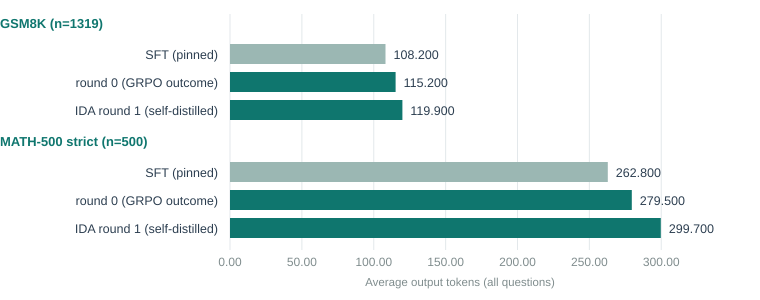
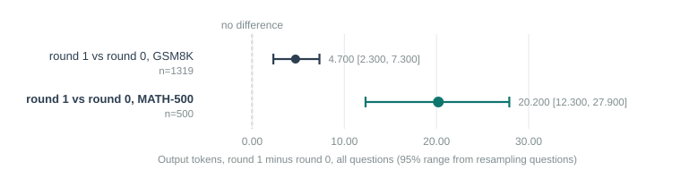

# Executive Summary

[Headline result:]{.lead} One additional round of iterated distillation and amplification (IDA) — using the project's best round-0 model to teach itself on 300 fresh questions, then retraining SFT and GRPO on the combined data — produced **no accuracy improvement** over round 0, on either benchmark, and **significantly longer** answers (+4.7 tokens on GSM8K, +20.2 on MATH-500). This matches the project's own earlier finding that more distilled data bought nothing (report on the month-2 campaign, GSM8K 0.77→0.82→0.79 unchanged by tripling the data), now shown again with genuine self-distillation rather than more external-teacher data.

[In plain terms:]{.lead} IDA is DeepCogito's actual core recipe: teach a model, let it get a little better, then have that improved model teach the *next* version from its own solutions, repeating. The project had built this loop (`train_ida.py`) but never finished a single round. This report finishes one, reusing the already-trained round-0 model as the self-teacher rather than starting over, and finds the same pattern the rest of this track has found: nothing moves, and the answers get a bit longer.

[Findings:]{.lead}

- Round 0 was not rebuilt from scratch. The pinned SFT model and its best GRPO checkpoint (report 6's `outcome` arm, GSM8K 0.804) were pulled from Hugging Face and used directly as round 0 and as the self-teacher, cutting this session's cost to the price of one round rather than two.
- Self-distillation on 300 fresh, disjoint GSM8K questions kept 237 verified traces (79% yield) — the round-0 champion reliably follows the tagged format and gets these grade-school problems right most of the time, unlike report 7's MATH pivot.
- Merged with the original 742, SFT retrained on 979 traces, then one GRPO round (`outcome` reward, same recipe as round 0) on a further 400 fresh questions.
- Round 1 vs round 0: GSM8K accuracy 0.800 vs 0.804 (95% range [−0.021, +0.016], not significant); MATH-500 0.376 vs 0.382 (range [−0.032, +0.020], not significant).
- Round 1 vs round 0 length: GSM8K +4.7 tokens (95% range [+2.3, +7.3], significant); MATH-500 +20.2 tokens (range [+12.3, +27.9], significant).
- NOTE: this is one round with one seed. It answers "does self-distillation help immediately," not "does it help over several rounds" — the IDA claim is specifically about repeated rounds compounding, which needs at least a second round to see any trend at all.

## Quick Stats

| Metric | Value |
|---|---|
| Round-0 source | Report 6's pinned SFT + `outcome` GRPO checkpoint, rehydrated from Hugging Face |
| Self-distillation pool | 300 fresh GSM8K train questions, 237 verified (79%) |
| Round-1 training data | 979 traces (742 original + 237 new), deduplicated |
| Round-1 GRPO pool | 400 further fresh GSM8K train questions |
| GSM8K accuracy, round 0 → round 1 | 0.804 → 0.800 (not significant) |
| MATH-500 accuracy, round 0 → round 1 | 0.382 → 0.376 (not significant) |
| GSM8K tokens, round 0 → round 1 | 115.2 → 119.9 (+4.7, significant) |
| MATH-500 tokens, round 0 → round 1 | 279.5 → 299.7 (+20.2, significant) |
| Session cost | part of a three-thread concurrent session; this thread alone finished in under 90 minutes |

# Problem Statement

The project brief named IDA as DeepCogito's own approach and flagged it as unfinished: "the IDA loop was coded but never finished a round... round 0 distillation completed, then all boxes were stopped mid-SFT." Separately, the project's month-2 campaign already found that simply tripling the amount of *externally*-distilled data (235 → 742 traces) bought nothing (GSM8K 0.77→0.82→0.79, unchanged). That result leaves open whether *self*-distillation — the actual IDA mechanism, where the model teaches its own next iteration rather than more of the same external data — behaves differently. This report tests that directly, for one round.

# Data

## Reusing round 0

Rather than rerun round 0 (which report 6 already produced and evaluated), this thread rehydrates it from Hugging Face: the SFT adapter (`sushanth9/prm-track-sft-adapter`) merged onto the base model, then the `outcome`-reward GRPO adapter (`sushanth9/prm-track-grpo-outcome`) merged on top of that. This merged model is round 0's "champion" and becomes round 1's self-teacher.

## Self-distillation

A fresh, disjoint 300-question pool (excluding the 742 trace questions and every question already consumed by earlier PRM or GRPO work in this project) was distilled by prompting the round-0 champion with the same `TEACHER_SYSTEM` prompt used throughout this project and keeping only completions that both used the tagged format and matched the reference answer. 237 of 300 were kept (79%), comparable to the yield external teachers achieved on the original 742-trace set.

Batched local generation (`distill_local.py`) was used rather than the project's original `distill.py`, since that script's concurrent-worker design is built for API-based teachers; running several threads against one shared local model on one GPU would not have parallelised usefully.

## Merged training set

The 237 new traces were merged with the original 742 by question, with no duplicates (the pools were built to be disjoint), giving 979 unique traces for round 1's SFT stage.

# Method

Round 1 repeats round 0's exact recipe on the larger dataset: SFT (LoRA rank 64, 2 epochs, batch 2 × grad-accum 16, `nll` loss) on the 979 traces, merged into the base model, then GRPO with the `outcome` reward (exact-match + format + length, matching round 0 exactly) on 400 further fresh GSM8K questions (disjoint from both the 742 and the 300-question distillation pool), 800 optimiser steps. Evaluation and statistics are identical to reports 6/7: full GSM8K (n=1,319) and MATH-500 (n=500), greedy decoding, McNemar plus a 2,000-resample bootstrap for paired differences.

# Results



| Model | GSM8K acc | GSM8K tokens | MATH-500 acc | MATH-500 tokens |
|---|---|---|---|---|
| SFT (pinned) | 0.794 | 108.2 | 0.380 | 262.8 |
| Round 0 (`outcome` GRPO) | 0.804 | 115.2 | 0.382 | 279.5 |
| Round 1 (self-distilled) | 0.800 | 119.9 | 0.376 | 299.7 |



| Comparison | Accuracy diff | 95% range | Token diff | 95% range |
|---|---|---|---|---|
| Round 1 vs round 0, GSM8K | −0.004 | [−0.021, +0.016] | +4.7 | [+2.3, +7.3] |
| Round 1 vs round 0, MATH-500 | −0.006 | [−0.032, +0.020] | +20.2 | [+12.3, +27.9] |

Accuracy is flat within noise on both benchmarks. Length moves the same direction it moved in every other GRPO arm in this project that includes `length_reward` (which round 1 does, matching round 0): significantly longer, not shorter. On GSM8K's both-correct subset the gap is smaller (+2.1 tokens, [+0.8, +3.4]) but still real; on MATH-500's both-correct subset it does not reach significance (+8.1, [−0.9, +16.9]), though the unconditional MATH-500 gap is large and clear.

# Limitations

- **One round, one seed.** IDA's actual claim is about compounding improvement across several rounds. A single round that shows nothing is consistent with either "self-distillation does not help at this scale" or "one round is not enough to see a trend" — this report cannot distinguish those, and a second round would be needed to tell them apart.
- **`length_reward` still active.** Report 7 showed this term is the dominant driver of length increases elsewhere in this project; round 1 uses the same reward mix as round 0 (including `length_reward`), so the length increase here is likely attributable to the same term, not to self-distillation specifically. This was not isolated for round 1.
- **Self-distillation pool size.** 300 questions, yielding 237 traces, is a modest addition to the existing 742 (32% more data). A larger self-distillation batch might behave differently.
- **No separate held-out check on the 237 new traces' quality** beyond exact-match verification; whether they are qualitatively different from the original 742 (e.g., more repetitive, since they come from a single self-teacher rather than two external teachers) was not examined.

# Code Structure & Reproducibility

Branch `reasoning/prm`. New code: `pool_utils.py` (a fresh-question-pool builder shared across threads, excluding every question set already used anywhere in the project) and `distill_local.py` (batched local self-distillation). `run_thread_a_ida.sh` runs the full round: rehydrate round 0 → build the self-distillation pool → self-distill → merge traces → SFT → merge → build the GRPO pool → GRPO → merge → evaluate → gaming diagnostic.

```
python -m training.reasoning.pool_utils --count 300 --out data/ida_round1_pool.jsonl
python -m training.reasoning.distill_local --teacher outputs/round0_champion \
    --pool data/ida_round1_pool.jsonl --batch 32 --out data/ida_round1.jsonl
python -m training.reasoning.train_sft --base Qwen/Qwen2.5-3B-Instruct \
    --data data/ida_sft_round1.jsonl --batch 2 --grad-accum 16 --seq-length 1024 --output outputs/ida_sft_round1
```

This thread ran concurrently with two others (reports 7's length-reward ablation and report 9's bigger PRM) on a separate rented RTX 4090, and finished first; its box was deleted immediately after results were pulled. The data behind this report's tables and figures is in `docs/prm-reports/data/grpo_eval_results.csv` and `grpo_paired_comparisons.csv` (rows labelled `IDA round 1 (self-distilled)`), extended in place rather than duplicated into new files.

# Appendix

## Discontinued Ideas

**Running `train_ida.py` as originally written.** That script always redistills round 0 from an external teacher before doing anything else, which would have repeated work already done and evaluated in report 6. Reusing the existing round-0 artifacts and self-distilling only the new round was cheaper and kept round 0 identical to its already-published numbers, at the cost of not exercising `train_ida.py`'s own round-0 code path.

**A second round.** Budgeted out of this concurrent session to keep all three threads' combined cost predictable. Worth doing as a direct follow-up: round 1's own champion would become round 2's self-teacher, using the same scripts.

## Glossary

<!--GLOSSARY: IDA; Fine-tuning; Trace; GRPO; Reward; Seed; Confidence interval (95% range); Bootstrap; Token; GSM8K; MATH-500-->
