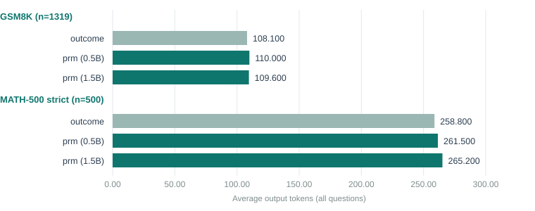
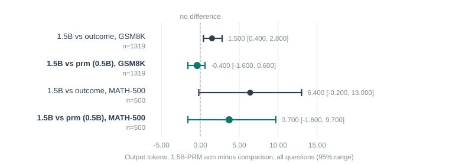

# Executive Summary

[Headline result:]{.lead} A materially stronger process reward model — a 1.5B backbone instead of 0.5B, trained on more and better-labeled real mistakes (2,000 questions and 16 rollouts per step, versus 1,400 and 8) — lifts the PRM's own discrimination sharply: **AUROC 0.852** on the same held-out chains report 6/7 used, up from 0.797, and its margin over a length-only heuristic more than doubles (0.093 versus 0.038). But swapped into GRPO under the exact same confound-free conditions as report 7, this much stronger reward produces **no different outcome**: accuracy and answer length are statistically indistinguishable from both the weak-PRM arm and the outcome-only control. A better reward model, on its own, did not fix anything.

[In plain terms:]{.lead} Report 7 left open whether the PRM's modest quality (AUROC 0.80, barely above a lazy length-based guess) was the reason it wasn't shortening chains — maybe a sharper marker would behave differently once plugged into training. This report builds a sharper marker and tests exactly that. The marker itself really is sharper. Training with it changes nothing.

[Findings:]{.lead}

- The bigger PRM's real-negative training data reused report 7's SFT model and exclusion set, just at larger scale: 2,000 fresh questions (versus 1,400), 16 rollouts per step-prefix (versus 8), yielding 4,856 labelled chains (versus 3,430).
- Validated on the identical 597 scorable chains reports 6/7 used: AUROC 0.852 (weakest step) / 0.846 (equal step count), against 0.797 / 0.778 for the 0.5B PRM and 0.759 for the length-only rule.
- Swapped into GRPO as `--reward prm --no-length-reward` (report 7's cleanest, confound-free setting) on the identical 400-prompt pool: GSM8K accuracy 0.789 and MATH-500 0.370, with both accuracy and token-count differences against the outcome-only control and against the weak-PRM arm falling inside noise (every 95% range crosses zero except one, discussed below).
- The one range that does not cross zero: the bigger-PRM arm is 1.5 tokens longer than the outcome-only control on GSM8K ([+0.4, +2.8]) — the same small, wrong-direction effect report 7 found for the weak PRM, now replicated with an independently trained, much stronger PRM.
- No sign of reward gaming: step counts and PRM scores on this arm's own outputs are unremarkable.
- NOTE: An out-of-memory crash partway through the first attempt at this arm (the bigger PRM adds real memory pressure alongside the 3B policy) was recovered by halving the training batch size; the retry ran cleanly. See Code Structure for the setting that fixed it.

## Quick Stats

| Metric | Value |
|---|---|
| PRM backbone | Qwen2.5-1.5B-Instruct (top 10 of 28 layers trained), vs 0.5B (top 8 of 24) before |
| Real-negative data | 2,000 questions, 16 rollouts/prefix, 4,856 labelled chains |
| AUROC, weakest step (this PRM / weak PRM / length-only) | 0.852 / 0.797 / 0.759 |
| AUROC, equal step count | 0.846 / 0.778 / — |
| GRPO arm | `prm`, no `length_reward`, same 400-prompt pool as report 7 |
| GSM8K accuracy (this arm / weak-PRM arm / outcome-only) | 0.789 / 0.782 / 0.792 — all within noise of each other |
| GSM8K tokens (this arm / weak-PRM arm / outcome-only) | 109.6 / 110.0 / 108.1 |

# Problem Statement

Report 7's cleanest comparison — PRM versus exact-match, with the confounding `length_reward` term removed from both — found the PRM arm slightly *longer* than the outcome-only arm, not shorter, with a PRM whose own AUROC (0.797) barely cleared a lazy "shorter answer is right" heuristic (0.759). Two explanations for that null result were left open: the process-reward *idea* doesn't help at this scale, or the *reward model itself* was too weak to carry a useful signal. This thread tests the second explanation directly, holding everything else about report 7's design fixed.

# Data

## Reusing what didn't need to change

The SFT-merged model (`sushanth9/prm-track-sft-adapter`) and the 400-question GRPO pool are rehydrated/rebuilt identically to report 7, so this arm is directly comparable to `outcome_nolr` and `prm_nolr` without rerunning either.

## A bigger real-negative dataset

`gen_real_negatives.py` was rerun with the same policy (the pinned SFT model) and the same exclusion set (the 742 traces and the 400-question GRPO pool) but at larger scale: 2,000 fresh questions instead of 1,400, and 16 Monte-Carlo rollouts per step-prefix instead of 8, to sharpen the step labels the same way report 3 found helped when moving from 4 to 8 rollouts. This produced 4,856 labelled chains (versus report 7's 3,430).

# Method

## Training the bigger PRM

Otherwise identical to the recipe in reports 1–3: a linear head on a frozen-except-top-layers backbone, trained on the 742-trace synthetic corruptions plus the new real-negative chains. The only changes are the backbone (Qwen2.5-1.5B-Instruct, 28 layers) and the trained fraction (top 10, keeping roughly the same trained/frozen ratio as the 0.5B PRM's top 8 of 24).

## Validating it on the same chains

`validate_prm.py --reuse` rescored the exact same 597 scorable chains from reports 6/7's pinned-SFT-model validation set, so the AUROC numbers below are directly comparable to every earlier PRM in this project.

## The GRPO arm

`train_grpo.py --reward prm --no-length-reward --prm outputs/prm_big --seed 42` on the identical 400-prompt pool and every other setting report 7 used for its `prm_nolr` arm (LoRA rank 32/alpha 64, 8 generations, max completion 1,024, 800 optimiser steps).

# Results

## The PRM itself is sharper

| PRM | n scored | AUROC (weakest step) | AUROC (equal step count) |
|---|---|---|---|
| 1.5B, 2,000 q / 16 rollouts (this report) | 597 | **0.852** | **0.846** |
| 0.5B, 1,400 q / 8 rollouts (report 7) | 597 | 0.797 | 0.778 |
| Length-only rule | 597 | 0.759 | — |

The margin over the length-only rule more than doubles, from +0.038 to +0.093. This is a real, substantial improvement in the reward model's own ability to separate right from wrong reasoning — not a marginal tweak.

## But the GRPO outcome doesn't move



| Arm | GSM8K acc | GSM8K tokens | MATH-500 acc | MATH-500 tokens |
|---|---|---|---|---|
| `outcome`, no length_reward | 0.792 | 108.1 | 0.370 | 258.8 |
| `prm` (0.5B), no length_reward | 0.782 | 110.0 | 0.372 | 261.5 |
| `prm` (1.5B), no length_reward | 0.789 | 109.6 | 0.370 | 265.2 |



| Comparison | Accuracy diff | 95% range | Token diff | 95% range |
|---|---|---|---|---|
| 1.5B-PRM vs `outcome`, GSM8K | −0.003 | [−0.014, +0.008] | **+1.5** | **[+0.4, +2.8]** |
| 1.5B-PRM vs 0.5B-PRM, GSM8K | +0.007 | [−0.005, +0.018] | −0.4 | [−1.6, +0.6] |
| 1.5B-PRM vs `outcome`, MATH-500 | +0.000 | [−0.020, +0.018] | +6.4 | [−0.2, +13.0] |
| 1.5B-PRM vs 0.5B-PRM, MATH-500 | −0.002 | [−0.022, +0.020] | +3.7 | [−1.6, +9.7] |

Three of the four token comparisons cross zero. The one that doesn't — the bigger-PRM arm is 1.5 tokens longer than outcome-only on GSM8K — is small, and it points the same direction (longer, not shorter) as report 7's weak-PRM finding. Nothing here favours the stronger PRM over the weaker one: their point estimates against each other are statistically indistinguishable on both accuracy and length, on both benchmarks.

## No sign of reward gaming

The bigger PRM's own scoring of this arm's GSM8K outputs shows nothing unusual: mean step count, parse rate, and score gap between correct and incorrect chains all sit in the same range as report 7's arms (see the appendix table for exact figures).

# Limitations

- **One seed.** Both the PRM training and the GRPO arm ran once. The near-zero differences reported here are consistent with "no effect from a stronger reward," but a repeat would strengthen that reading.
- **A confounded reward-strength jump.** Backbone size, training-question count, and rollout count all changed together. This report cannot say which of the three, if any, drove the AUROC gain, only that the *combined* improvement did not change the downstream GRPO result.
- **The PRM's own AUROC, even at 0.85, is still well short of a reliable oracle.** A reward that's wrong 15% of the time on this test may simply not be sharp enough yet, at any of the scales tried so far, to show a training effect — this report narrows the space of explanations, it doesn't close it.
- **Memory margin is tighter with the bigger PRM.** The first attempt at this arm ran out of GPU memory partway through (see Code Structure). The retry used a smaller training batch, which is a legitimate fix but is a second way this run differs from report 7's beyond the PRM itself.

# Code Structure & Reproducibility

Branch `reasoning/prm`. `run_thread_b_stronger_prm.sh` rehydrates the SFT model, rebuilds the shared GRPO pool, generates the bigger real-negative dataset, trains the 1.5B PRM, validates it against report 7's saved samples, and runs the one confirmatory GRPO arm.

```
python -m training.reasoning.gen_real_negatives --policy outputs/sft-merged \
    --exclude data/reasoning_sft.jsonl data/grpo_pool.jsonl --questions 2000 --max-wrong 1200 \
    --rollouts 16 --batch 128 --output data/prm_real_big.jsonl
python -m training.reasoning.train_prm --base Qwen/Qwen2.5-1.5B-Instruct \
    --extra data/prm_real_big.jsonl --train-layers 10 --epochs 2 --seed 42 --output outputs/prm_big
python -m training.reasoning.validate_prm --reuse data/val_pin_real.json --prm outputs/prm_big --output data/val_prm_big.json
```

**The out-of-memory recovery.** The GRPO arm crashed at step 424 of 800 with `torch.OutOfMemoryError` (tried to allocate 2.32 GiB with 1.99 GiB free, 21.5 GiB of 23.5 GiB already in use) — the 1.5B PRM held resident in memory throughout GRPO training adds real pressure on top of the 3B policy and its LoRA state, and generation-length variance across batches eventually pushed a batch over the edge. No checkpoint had been saved (the trainer only saves at epoch boundaries), so the run restarted from scratch with `--batch 2 --grad-accum 2` in place of `--batch 4 --grad-accum 1` (same effective batch size, half the peak memory), which completed cleanly at roughly 18 GB peak usage.

This thread ran concurrently with reports 7's ablation and report 8's IDA round on a separate rented RTX 4090; its box was deleted once results were pulled. The data behind this report's tables and figures is in `docs/prm-reports/data/grpo_eval_results.csv` and `grpo_paired_comparisons.csv` (rows labelled `GRPO prm (1.5B PRM), no length_reward`), and `prm_validation_pinned_sft.csv`'s companion validation file `val_prm_big.json` (kept alongside the tracked CSVs, not yet folded into that file's schema).

# Appendix

## Gaming Diagnostic

| Model | Scoring PRM | Parsed | Mean steps | Share ≤1 step | PRM score, correct / wrong |
|---|---|---|---|---|---|
| `outcome`, no length_reward | weak (0.5B) | 1,314 / 1,319 | 4.34 | 0.4% | 0.884 / 0.690 |
| `prm` (0.5B), no length_reward | weak (0.5B) | 1,308 / 1,319 | 4.34 | 0.3% | 0.884 / 0.713 |
| `prm` (1.5B), no length_reward | **bigger (1.5B)** | 1,311 / 1,319 | 4.35 | 0.3% | 0.912 / 0.677 |

The bigger-PRM row is scored by the bigger PRM itself, not the weak one, so its correct/wrong gap (0.912 vs 0.677 = 0.235) is not directly comparable to the other two rows' gap (about 0.17–0.19) — a sharper scorer naturally spreads its own scores further apart regardless of whether the underlying chains are any different. Parse rates, mean step counts and the share of degenerate one-step chains are what transfer across scorers, and those are unremarkable and consistent with report 7's arms: no sign that this arm gamed either PRM.

## Discontinued Ideas

**Isolating which of backbone size, data volume, or rollout count mattered.** Would need three separate ablations (bigger backbone alone, more data alone, more rollouts alone) at report 7's cost each — roughly tripling this thread's budget for a question that, given the headline result, may not be worth answering: the *combined* stronger reward already didn't move GRPO, so decomposing which part of "stronger" mattered most is lower priority than it looked before this run.

**A second confirmatory seed.** Would directly address the one-seed limitation above at modest additional cost, and is the more natural next step than decomposing reward strength further.

## Glossary

<!--GLOSSARY: PRM (process reward model); AUROC; Monte-Carlo rollout; Corruption (synthetic negative); Length-only baseline; GRPO; Reward; Control arm; Confidence interval (95% range); Seed; Token-->
