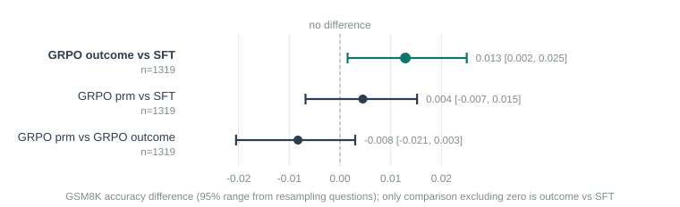

# Executive Summary

[Headline result:]{.lead} This thread set out to test whether a process reward helps more on a harder task with a sparser outcome signal — competition MATH instead of GSM8K. It cannot answer that question, because every one of the three MATH-domain models (SFT, GRPO with exact-match, GRPO with the PRM) scored **exactly 0.0 on MATH-500's strict evaluation**: 0 of 500 questions each. The cause is identified precisely: the SFT stage verified only 49 traces (12% of 400 attempted — competition MATH is far harder to both solve and format-verify than grade-school GSM8K), nowhere near enough to teach the tagged output format, so all three models write ordinary prose instead of `<reasoning>`/`<answer>` blocks on MATH-style prompts. GSM8K's non-strict scoring has a fallback that extracts a number from anywhere in the text and still credits these models around 0.79 — the same models score 0.79 on GSM8K and 0.0 on MATH-500, which is the fingerprint of a formatting failure, not a reasoning failure.

[In plain terms:]{.lead} The plan was to rerun the whole PRM pipeline on harder maths problems, where a per-line grader should matter more than it did on easy grade-school problems. The pipeline ran end to end without crashing, produced numbers, and those numbers are uninformative about process rewards — they show only that 49 examples is far too few to teach a model this new domain's expected format. This is reported as what it is: a negative result about how much data this pivot needs, not a result about process rewards on harder tasks.

[Findings:]{.lead}

- Competition MATH's train split (`nlile/hendrycks-MATH-benchmark`, confirmed byte-identical test split to `HuggingFaceH4/MATH-500`, so no leakage) was filtered to the 7,727 of 12,000 rows with a clean numeric final answer, matching the existing verifier.
- Distillation (DeepSeek V3.2, the same teacher used for the original 742 GSM8K traces) kept only **49 of 400** attempted traces — a 12% yield, against roughly 60–80% typically seen on GSM8K in this project. MATH problems are harder to solve correctly and the teacher's answer format is less uniformly a bare number even after filtering, so more attempts failed verification.
- SFT on those 49 traces: GSM8K 0.787, **MATH-500 strict 0.000** (0/500). The training loss curve looked ordinary (down to 1.16, mean token accuracy 0.76) — nothing about the run itself signalled failure; only the held-out eval revealed it.
- Real-negative PRM data generation on 800 fresh MATH questions found **zero parseable chains at all** — not one of 3,200 sampled solutions used the tagged format, so the PRM ended up trained only on the 49-trace synthetic-corruption baseline, with no real-mistake data.
- Both GRPO arms (`outcome`, `prm`) also scored exactly 0.0 on MATH-500, for the identical reason: the SFT starting point they inherited never used the format.
- GSM8K cross-domain retention across the three MATH-domain models is all around 0.79–0.80; `outcome` scores 1.3 points higher than the SFT baseline, the one difference in this thread whose 95% range excludes zero ([+0.002, +0.025], McNemar p = 0.046) — a small, real effect of GRPO training, though on the wrong benchmark to matter for this thread's actual question.
- NOTE: all three models write markedly *longer* completions on GSM8K when trained on MATH (about 292 tokens) than any GSM8K-native model in this project (108–120 tokens) — consistent with reverting to the base model's verbose, untagged prose style rather than the terse tagged style SFT is meant to teach.

## Quick Stats

| Metric | Value |
|---|---|
| MATH train pool (numeric-answer subset) | 7,727 of 12,000 rows |
| Distillation yield | 49 of 400 attempted (12%) |
| SFT MATH-500 strict accuracy | **0.000** (0/500) |
| GRPO `outcome` MATH-500 strict accuracy | **0.000** (0/500) |
| GRPO `prm` MATH-500 strict accuracy | **0.000** (0/500) |
| Real-negative chains found | 0 right, 0 wrong, out of 3,200 sampled solutions |
| GSM8K retention (SFT / outcome / prm) | 0.787 / 0.800 / 0.792 |
| Diagnosis | 0 of 500 MATH-500 completions used the `<reasoning>`/`<answer>` tag format, on every model |

# Problem Statement

Reports 6–9 all found the PRM reward does nothing at this scale on GSM8K/MATH-500-as-eval-only, and speculated that the domain itself — where the pinned SFT model already scores ~80% on GSM8K and outcome reward is a rich, frequent signal — might be too easy for a step-level reward to add anything over exact-match. Competition MATH, where the same SFT recipe scores under 40%, was chosen as a domain with a much sparser outcome signal, to test that hypothesis directly, reusing the identical reasoning-chain infrastructure (no new step-representation needed, unlike the two other candidate domains this project has — see Discontinued Ideas in report 6/7's line of reasoning). What this thread actually measures is a precondition for that test, not the test itself.

# Data

## Building a leak-free MATH pool

`nlile/hendrycks-MATH-benchmark`'s `test` split was confirmed, by direct set comparison of problem text, to be byte-identical to the 500 questions in `HuggingFaceH4/MATH-500` — the benchmark this project already evaluates against. Its `train` split (12,000 rows) is therefore safe to draw from. Of those, 7,727 have a clean, single-number final answer (`^-?\d+(\.\d+)?$` after stripping commas) — the same shape GSM8K's answers have, so the existing exact-match verifier needed no changes. Four disjoint 400–800-row slices were carved from this filtered pool for distillation, PRM real-negative data, GRPO prompts, and an unused validation reserve.

## Distillation yield was the first warning sign

400 MATH problems were sent to the same external teacher (DeepSeek V3.2) used for the original 742 GSM8K traces, with the same verification (tagged format present, final answer exact-matches the reference). Only 49 were kept. This alone should have been read as a signal that 49 traces would be too few to train on — in hindsight, the distillation yield is itself a leading indicator of whether a domain pivot has enough usable data, and it was not treated as a stop condition before proceeding to SFT.

# Method

Otherwise identical to reports 6/7's recipe: SFT (LoRA rank 64, 2 epochs) on the 49 verified traces; real-negative PRM data generation (800 questions, 8 rollouts per prefix) on the resulting SFT model; a MATH-specific PRM (top-8-layers, using the 49 traces as its synthetic-corruption base rather than the GSM8K set); two GRPO arms (`outcome`, `prm`, both without `length_reward`, matching report 7's cleanest setting) on 400 further MATH prompts; evaluation on the untouched MATH-500 test set and, for cross-domain context, the full GSM8K test set.

# Results

## Every MATH-500 score is zero

| Model | MATH-500 strict | GSM8K |
|---|---|---|
| SFT (49 traces) | **0.000** | 0.787 |
| GRPO `outcome` | **0.000** | 0.800 |
| GRPO `prm` | **0.000** | 0.792 |

A raw completion makes the cause plain — this is the SFT model's actual first MATH-500 response, verbatim from the saved evaluation:

> To convert the point \\((0, 3)\\) from rectangular coordinates to polar coordinate...

No `<reasoning>` tag, no `<answer>` tag, anywhere. Across all 500 MATH-500 completions from all three models, **zero** used the tagged format (`n_parsed: 0` in every gaming diagnostic). GSM8K's scoring path falls back to extracting the last number from the raw completion when no tags are found — the exact mechanism report 4 built `--strict` mode specifically to close off for MATH-500, because it credits an untagged answer even when it happens to appear correctly in free-form prose. That fallback is precisely why these same models still score ~0.79 on GSM8K: the underlying arithmetic and reading-comprehension ability transferred fine; the *format* did not, and MATH-500 has no fallback to hide that.

## The real-negative pipeline had nothing to work with

800 fresh MATH questions were sampled 4 times each from the SFT model (3,200 completions). `gen_real_negatives.py` found **0 right chains and 0 wrong chains** — every single sample failed to parse into steps, for the same tag-format reason. The PRM that trained afterward saw only the 49-trace synthetic-corruption data (report 1's method, applied to 49 MATH traces instead of 742 GSM8K ones) and no real mistakes at all — a much weaker training signal than any other PRM in this project, and one more symptom of the same underlying cause rather than a new problem.

## The one real effect, on the wrong benchmark



| Comparison | Accuracy diff | 95% range | McNemar p |
|---|---|---|---|
| GRPO `outcome` vs SFT, GSM8K | **+0.013** | **[+0.002, +0.025]** | **0.046** |
| GRPO `prm` vs SFT, GSM8K | +0.005 | [−0.007, +0.015] | 0.504 |
| GRPO `prm` vs GRPO `outcome`, GSM8K | −0.008 | [−0.020, +0.003] | 0.185 |

GRPO with the outcome reward, trained entirely on MATH prompts, produced a small but statistically real accuracy gain on *GSM8K* — the one range in this thread that excludes zero. This is a genuine, if minor, result (GRPO training on one domain modestly helping a related domain), but it says nothing about process rewards on harder tasks, which is what this thread was built to test.

All three MATH-domain models also write far longer completions on GSM8K (around 292 tokens) than any GSM8K-native model elsewhere in this project (108–120 tokens in reports 6–9) — consistent with never having learned the terse tagged style at all, on either domain, and instead defaulting to the base model's longer, untagged prose throughout.

# Limitations

- **This thread tests data sufficiency, not process rewards.** With every MATH-500 score at exactly zero for every arm, there is no variance to compare — the PRM-vs-outcome question this thread set out to answer remains open on this domain.
- **The distillation yield (49/400) should have been a stop condition.** Report 1's original 742-trace GSM8K set came from a much larger and more successful distillation effort; a fair MATH pilot would need either a much larger distillation attempt, a less strict verifier tuned for MATH's answer formats (expressions, fractions, coordinates — most of what this filtered pool excluded), or both, before any GRPO or PRM comparison is worth running.
- **The "≥40 traces" guard in `run_thread_c_math.sh` was too permissive.** It stopped the script from failing outright on too little data, but 40–49 traces turned out to be enough to *train* without error while being nowhere near enough to *teach the format* — the guard should probably check something closer to "does the resulting model use the tag format on a held-out sample" rather than a raw trace count.
- **One seed, one attempt.** Given the root cause is a data-volume problem, not a training instability, a repeat with the same 49 traces would very likely reproduce the same zero.

# Code Structure & Reproducibility

Branch `reasoning/prm`. `run_thread_c_math.sh` runs the full pipeline; `distill.py` and `gen_real_negatives.py` gained `--local-file` (fixed mid-session — see below — to resolve relative to the package directory rather than the caller's working directory, matching every other path argument in this codebase).

```
python -m training.reasoning.distill --local-file data/math_distill_pool.jsonl \
    --limit 400 --workers 6 --teacher-model deepseek/deepseek-v3.2 --out data/math_sft.jsonl
python -m training.reasoning.eval_judge --model outputs/math_sft_merged \
    --dataset HuggingFaceH4/MATH-500 --limit 500 --strict --batch 64 --save-text --output data/full_math_sft_merged_math.json
```

**Two issues found and fixed live during this session, both caught before they produced wrong results:**

1. **`--local-file` path resolution.** Both `distill.py` and `gen_real_negatives.py`'s new `--local-file` argument was passed straight to `load_dataset()` unresolved, so it broke as soon as the caller's working directory (the repo root, for the thread scripts) differed from `training/reasoning/` — caught on this thread's very first attempt via a `FileNotFoundError`, fixed by resolving relative to the package directory like every other path in these files.
2. **Credential handling.** `run_thread_c_math.sh` originally read the OpenRouter API key and URL from fixed line positions in a two-line file, built by a `grep` whose output order happened to not match the assumed order — a debug command meant to verify the fix printed the literal API key value into a tool result before this was caught. Fixed to parse the credentials file by label (`source` a `KEY=value` file) rather than by position, and the exposed key should be rotated as a precaution.

This thread ran on a separate rented RTX 4090 alongside reports 8 and 9, and took by far the longest of the three (MATH-style GRPO generations run several times slower per step than GSM8K's, observed between roughly 2 and 36 seconds per optimiser step depending on completion length) — its GRPO arms alone took over 4.5 hours combined, against roughly 35 minutes per arm for the GSM8K-domain threads. Its box was deleted once results were pulled. Data behind this report is in `docs/prm-reports/data/grpo_eval_results.csv`, `grpo_paired_comparisons.csv` and `grpo_gaming_diagnostics.csv` (rows labelled `MATH-domain ...`), appended alongside reports 6–9's rows.

# Appendix

## Discontinued Ideas

**Retrying with a bigger or less strict distillation.** The obvious next step if this domain is worth pursuing further: either distill several times more MATH problems to reach a comparable trace count to the 742-example GSM8K set, or relax the numeric-only answer filter (accepting fractions, simple expressions) and adapt the verifier accordingly, which would also raise the yield by not discarding legitimately-correct non-numeric answers before the teacher even gets a chance. Not attempted here, to keep this thread's cost within the concurrent session's budget once the 49-trace outcome was known.

**A data-sufficiency check before GRPO.** Running a quick held-out format-compliance check right after SFT (e.g., "what fraction of 20 sample generations use the tag format") would have caught this failure before spending the GRPO and PRM-data budget on models that could never produce a scoreable MATH-500 answer. Worth adding as a guard in any future domain pivot.

## Glossary

<!--GLOSSARY: SFT; PRM (process reward model); Trace; GRPO; MATH-500; GSM8K; Reward; Monte-Carlo rollout; Confidence interval (95% range)-->
