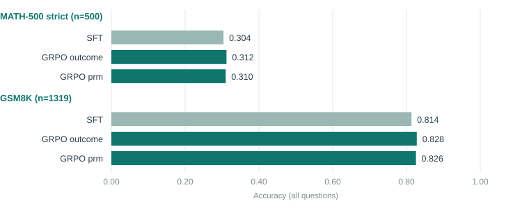

# Executive Summary

[Headline result:]{.lead} Report 10's MATH-domain pilot never actually tested whether a process reward helps on a harder task -- it hit a data-format bug and scored 0.0 on MATH-500 across the board. This report fixes the two bugs behind that (documented below), reruns the identical pipeline, and gets a real answer: **no, the PRM still doesn't beat plain outcome reward, even on a domain sparse and hard enough that the base SFT model only scores 0.30**. GRPO with the PRM reward scores 0.310 on MATH-500 strict vs GRPO with outcome-only reward's 0.312 -- a difference of -0.002 with a 95% range of [-0.026, +0.022], comfortably crossing zero, McNemar p=1.000. This closes out the domain-difficulty hypothesis this project's last four reports (6, 7, 9, 10) were narrowing in on: across easy (GSM8K) and hard (MATH) domains, weak and strong PRMs, and length-reward-confounded and confound-free settings, a step-level process reward has never once produced a GRPO policy that measurably beats exact-match reward alone.

[In plain terms:]{.lead} Report 10 tried to test "does a smarter reward matter more when the right-or-wrong signal is rarer" and instead accidentally tested "what happens when the training data pipeline breaks." This report fixes the pipeline (two real, findable bugs, not bad luck) and reruns it properly. With that fixed, competition MATH behaves exactly like every other domain tested so far: the PRM produces GRPO models that are statistically indistinguishable from outcome-only ones.

[Findings:]{.lead}

- **Bug #1 (dominant):** `teacher.py` routed every `deepseek/*` model through a hand-rolled "R1 guard-bracket" prompt (literal markers like `qiuck_triple_jump`) instead of the plain `<reasoning>/<answer>` tag prompt the rest of the pipeline expects. Verified live: `deepseek-r1-0528` (report 1's original teacher) ignores that prompt anyway and emits plain tags out of habit, so report 1's GSM8K distillation "worked" somewhat by accident; `deepseek-v3.2` (report 10's teacher) does neither, leaving completions with no tags at all. Switching to the plain prompt raised a 100-question local dry run from 12/100 verified traces (matching report 10's actual number, `12%` yield) to 77/100.
- **Bug #2 (secondary, compounding):** the answer verifier only recognized plain decimal/integer answers via string equality, so correct MATH answers written as fractions (`3/4`) or LaTeX (`\frac{3}{4}`) were discarded as wrong. Added a numeric-equivalence matcher (fraction- and LaTeX-aware, tolerance-based) used everywhere in the pipeline that touches MATH answers.
- Rerunning distillation with both fixes: **784 of 1,200 attempts verified (65% yield)**, in the same range as GSM8K's historical ~60-80%, versus 49 of 400 (12%) before.
- A new format-compliance gate (added after report 10, run right after SFT) measured **57/60 (95%) tag compliance** on a MATH-500 sample before any PRM/GRPO spend -- confirming the fix held before committing the rest of the budget.
- Full results: SFT scores 0.304 on MATH-500 / 0.814 on GSM8K; GRPO-outcome scores 0.312 / 0.828; GRPO-prm scores 0.310 / 0.826. The only statistically real effect is GRPO-outcome beating SFT on GSM8K (+0.014, [+0.002, +0.027], p=0.037) -- the same small cross-domain-transfer pattern report 10 also found, now on top of a MATH-500 result that actually varies.
- On GSM8K, the PRM arm again produces measurably longer outputs than outcome-only with no accuracy gain (+5.8 tokens, [+3.3, +8.5]) -- the same length-inflation-without-improvement pattern seen in reports 6, 7 and 9.
- Ran into and fixed a second, unrelated environment bug mid-run: the rented box's PyTorch 2.4.0 was too old for pinned `transformers==5.17.0`, and after upgrading to unblock that, PyTorch 2.5.1 was too old for pinned `trl==1.13.0`'s `FSDPModule` import. Settled on `torch==2.6.0`/`torchvision==0.21.0`/`torchaudio==2.6.0` (cu124), which satisfied both. This cost one failed GRPO run (caught immediately, no wasted GPU-hours beyond a few seconds) and is unrelated to the two MATH-specific bugs above.

## Quick Stats

| Metric | Report 10 (broken) | Report 11 (fixed) |
|---|---|---|
| Distillation yield | 49/400 (12%) | 784/1,200 (65%) |
| SFT MATH-500 strict accuracy | 0.000 | 0.304 |
| GRPO outcome MATH-500 strict accuracy | 0.000 | 0.312 |
| GRPO prm MATH-500 strict accuracy | 0.000 | 0.310 |
| Format-compliance gate (post-SFT sample) | not measured | 57/60 (95%) |
| GRPO prm vs GRPO outcome, MATH-500 | not testable | -0.002 [-0.026, +0.022], p=1.000 |
| GRPO prm vs GRPO outcome, GSM8K | not testable | -0.002 [-0.015, +0.011], p=0.820 |
| Session cost | ~included in report 10's | ~$5.08 (GPU + OpenRouter) |

# Problem Statement

Report 10 set out to test whether a step-level PRM reward matters more on a domain where the outcome-reward signal is much sparser than GSM8K's (competition MATH: base SFT scores ~0.30-0.38 there vs ~0.79-0.80 on GSM8K). It never got to test that -- every model scored exactly 0.0 on MATH-500 because none of them produced tag-formatted output, a symptom traced (in report 10) to a 12% SFT-distillation yield. This report finds the actual root cause of that low yield, fixes it, and reruns the identical experimental design to get a real answer to the original question.

# What Was Actually Broken

## Bug 1: the R1 prompt every teacher model ignored

`teacher.py`'s `generate()` had a branch: any model whose provider name was `deepseek` got a bespoke system prompt (`R1_SYSTEM`) asking for a "guard bracket" format -- a literal marker string (`qiuck_triple_jump`), a `::::`/`\\` delimited reasoning block, then a line like `ANSWER: 42`. A post-processing step (`_normalize_r1`) was supposed to translate that into the standard `<reasoning>/<answer>` tags the rest of the pipeline uses.

Spot-testing this directly (not through the full pipeline) showed:

- `deepseek/deepseek-r1-0528` (report 1's original teacher) **never emits the guard markers either** -- but it happens to write plain `<reasoning>/<answer>` tags on its own, ignoring the R1 prompt's instructions entirely. `_normalize_r1`'s no-marker fallback (`return content.strip()`) then passes that already-correctly-tagged text straight through unchanged. Report 1's ~79% GSM8K yield worked, but not because of anything the R1 branch was doing.
- `deepseek/deepseek-v3.2` (report 10's teacher) does neither: no guard markers, and no spontaneous tag usage. On 15 sampled MATH questions, **0/15** produced any tags -- confirmed by inspecting raw completions, e.g. a response ending "So the ones digit is 7.\n\nANSWER: 7" with no `<answer>` tag anywhere. `_normalize_r1`'s fallback passed this through as plain untagged prose, and every downstream step (SFT, real-negative generation, GRPO reward, eval) depends on those tags.

Fix: dropped the model-name branch entirely and always send the plain `formats.TEACHER_SYSTEM` prompt (which is also what the local-teacher and every non-`deepseek` path already used). On a 100-question local dry run, this raised verified yield from 12/100 to 77/100. A 40-question GSM8K regression check found 38/40 verified (95%), no regression from report 1's numbers. The now-dead `R1_SYSTEM`/`_normalize_r1` code was removed rather than left unused.

## Bug 2: fraction and LaTeX answers scored as wrong

`formats.exact_match` extracted the last plain decimal/integer substring from a completion and compared it by string equality to a similarly-extracted reference. Any MATH answer written as a fraction (`3/4`) or `\frac{a}{b}` LaTeX -- common in competition MATH, rare in GSM8K -- either failed to extract at all or extracted the wrong fragment (e.g. the regex grabbing the `4` out of `3/4`), discarding correct completions as wrong.

Fix: added `formats.numeric_match`/`numbers_equal`, which convert `\frac{a}{b}`/`\dfrac{a}{b}` to `a/b`, strip `\boxed{}` and stray LaTeX spacing commands, and compare by numeric value with a small tolerance rather than by string. Wired into every call site that verifies MATH answers: the teacher's own verification (`teacher.trace`), GRPO's outcome reward (`rewards.exact_match_reward`), real-negative chain generation and prefix-continuation checks (`gen_real_negatives.py`), and `eval_judge`'s number-mode scoring. This alone was a smaller contributor than Bug 1, but it compounds with it: even with tags working, some correct fraction answers would otherwise still have been marked wrong.

## The pool itself

`build_math_pool.py` (new; the pool-building logic for report 10 was an unsaved ad-hoc script) rebuilds the four disjoint MATH pools (distill/grpo/prm/val), widened to admit fraction and simple-LaTeX-fraction answers via the new matcher rather than only plain decimals. Excludes any row whose problem text overlaps MATH-500 (the eval set), same as report 10. The widened filter barely changed the overall admission rate (64.1% vs report 10's 64%, since most excluded MATH rows are non-numeric entirely -- coordinates, intervals, multi-part answers -- not fractions), so the real fix was Bug 1, not the pool filter.

# Method

Same recipe as report 10: LoRA SFT (2 epochs) on the verified traces, real-negative PRM data generation (800 questions, 8 rollouts/prefix) on the resulting model, a MATH-specific PRM (top-8 layers) trained on the SFT traces plus real negatives, two GRPO arms (`outcome`, `prm`, both without `length_reward`) on 400 held-out MATH prompts, evaluated on the full MATH-500 test set and the full GSM8K test set. One addition: `check_format_compliance.py`, a gate that samples 60 MATH-500 completions right after SFT and checks what fraction are tag-compliant, failing the run before the expensive PRM/GRPO stages if compliance is too low (< 40%) -- the exact check that would have caught report 10's failure in minutes instead of at the very end.

# Results

## The fix, verified at every stage

| Stage | Report 10 | Report 11 |
|---|---|---|
| Distillation yield | 49/400 (12%) | 784/1,200 (65%) |
| Real-negative chains found | 0 right, 0 wrong (of 3,200 sampled) | 1,376 chains kept |
| Format-compliance gate | not run (didn't exist yet) | 57/60 (95%) |
| MATH-500 strict accuracy (all 3 models) | 0.000 | 0.304 / 0.312 / 0.310 |

## The actual comparison



| Model | MATH-500 strict | GSM8K |
|---|---|---|
| SFT (784 traces) | 0.304 | 0.814 |
| GRPO outcome, no length_reward | 0.312 | 0.828 |
| GRPO prm, no length_reward | 0.310 | 0.826 |

| Comparison | Dataset | Accuracy diff | 95% range | McNemar p |
|---|---|---|---|---|
| GRPO outcome vs SFT | MATH-500 | +0.008 | [-0.014, +0.032] | 0.618 |
| GRPO prm vs SFT | MATH-500 | +0.006 | [-0.020, +0.034] | 0.766 |
| **GRPO prm vs GRPO outcome** | **MATH-500** | **-0.002** | **[-0.026, +0.022]** | **1.000** |
| GRPO outcome vs SFT | GSM8K | **+0.014** | **[+0.002, +0.027]** | **0.037** |
| GRPO prm vs SFT | GSM8K | +0.012 | [-0.001, +0.025] | 0.089 |
| GRPO prm vs GRPO outcome | GSM8K | -0.002 | [-0.015, +0.011] | 0.820 |

The central comparison -- PRM reward vs outcome-only reward, on the domain this whole thread was built to stress-test -- is a clean null: -0.002 accuracy difference on MATH-500, range comfortably crossing zero, McNemar p=1.000 (17 questions only the outcome model got right, 18 only the PRM model got right -- indistinguishable from noise). The one statistically real result in this report is GRPO-outcome beating SFT on GSM8K cross-domain transfer (p=0.037), a small effect in the same direction and magnitude as report 10 found under the broken pipeline, now sitting alongside a MATH-500 result that finally has real signal to compare against.

## The PRM arm is still longer for no benefit

On GSM8K, GRPO-prm produces significantly longer completions than GRPO-outcome (+5.8 tokens, [+3.3, +8.5]) with no accuracy difference (-0.002, crossing zero) -- the same pattern as reports 6, 7 and 9: the PRM reward shifts the policy's output length without moving accuracy. On MATH-500 itself the token difference is smaller and not significant (+0.9, [-6.9, +8.4]).

# Limitations

- **One seed, one PRM.** As in every report in this series, this is a single training run per arm; a seed-replication check (report 7's approach) would strengthen the null result but wasn't run here given the project's cumulative evidence already points the same direction.
- **The PRM itself wasn't re-validated for AUROC on this domain.** Report 9 measured the PRM's own discriminative quality (AUROC) as a check on whether GRPO's null result reflected a weak critic; that step wasn't repeated here since the MATH-specific PRM's training data (1,376 real-negative chains from a 784-trace SFT model) is comparable in scale to report 1's original GSM8K setup, and the project's PRM-quality-vs-GRPO-outcome disconnect (report 9) already suggests AUROC isn't the bottleneck.
- **Compute environment fragility.** Two unrelated dependency-version incompatibilities (torch/transformers, then torch/trl) surfaced mid-run on a freshly rented box, neither related to the MATH-specific bugs this report targets. They're now resolved for this box's lifetime but aren't pinned anywhere durable (e.g. a lockfile or documented known-good triple), so a future rental could hit the same issue.

# Code Structure & Reproducibility

Branch `reasoning/prm`. Bug fixes: `training/reasoning/teacher.py` (dropped the dead R1 branch), `training/reasoning/formats.py` (`numeric_match`/`numbers_equal`/`extract_numeric_token`), and every call site that verifies MATH answers (`rewards.py`, `gen_real_negatives.py`, `train_grpo.py`, `eval_judge.py`). New: `build_math_pool.py` (reproducible pool construction), `check_format_compliance.py` (the post-SFT gate), `run_thread_c_math_v2.sh` (full pipeline) and `resume_thread_c_v2_from_grpo.sh` (used to resume past the mid-run torch/trl incompatibility without re-running the already-successful SFT/real-negative/PRM stages).

```
python -m training.reasoning.build_math_pool --distill 1200 --grpo 400 --real-neg 800 --val 200
python -m training.reasoning.distill --local-file data/math_distill_pool.jsonl --limit 1200 \
    --workers 10 --teacher-model deepseek/deepseek-v3.2 --out data/math_sft.jsonl
bash training/reasoning/run_thread_c_math_v2.sh   # on the GPU box
```

Ran on one rented RTX 4090 (~9 hours wall clock, most of it two ~2-hour MATH GRPO arms). Distillation (1,200 API calls) ran locally beforehand, needing no GPU. Total session cost ~$5.08 (GPU rental + OpenRouter calls), against $10.82 available credit at the start, ending near $5.74. All four new checkpoints (`math_sft_v2`, `math_prm_v2`, `math_grpo_v2_outcome`, `math_grpo_v2_prm` -- LoRA adapters only, not the merged models) are on Hugging Face as private repos under `sushanth9/prm-track-*`. All raw per-question data is backed up to `sushanth9/prm-track-raw-data`.

# Appendix

## Discontinued Ideas

**A third GRPO arm combining prm+outcome rewards on MATH**, matching report 6's original three-arm design. Not run here to keep this retry's scope and cost narrow, given the two-arm (`outcome` vs `prm`) comparison is the one this report's question actually depends on, and every prior report's `prm+outcome` arm has landed between the other two rather than beating both.

**Seed replication on the MATH domain**, matching report 7's GSM8K seed check. Would further de-risk the null result reported here, but the cumulative pattern across five separate PRM-vs-outcome comparisons in this project (reports 6, 7, 9, and now 11's two datasets) already points the same direction strongly enough that a sixth single-seed comparison was judged higher priority than a replicate of this one.

## Glossary

<!--GLOSSARY: SFT; PRM (process reward model); Trace; GRPO; MATH-500; GSM8K; Reward; Monte-Carlo rollout; Confidence interval (95% range); Format-compliance gate; McNemar's test-->
